# SignRadial 快速验证实验 — 汇总报告

**实验日期**：2026-08-06 ~ 2026-08-07
**实验目录**：`workspace/SRR/`
**核心方法**：SignRadial（p=1 radial coefficient）

$$S_1 = \frac{|\sum_i \text{sign}(x_i)(y_i-x_i)|}{\sum_i |x_i|}$$

**一句话结论**：SignRadial 用符号抵消分离"相干误差 vs 不相干噪声"，**稳定检测 scale / 低精度 / replay 攻击**，是本次验证选出的最优径向检测器；与 ProjCos 组成双头可覆盖全部盲点。

**图像索引**：全部实验图内嵌如下（fig1–fig10）。

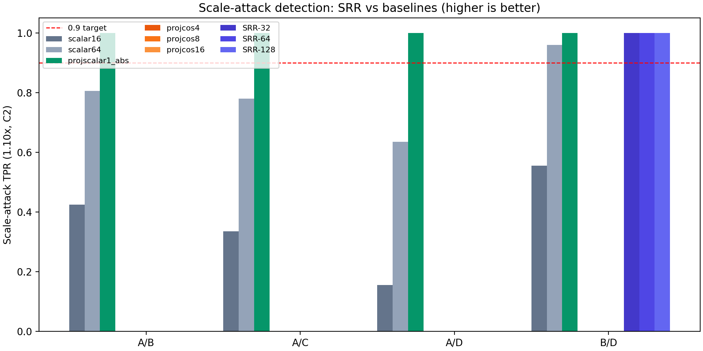

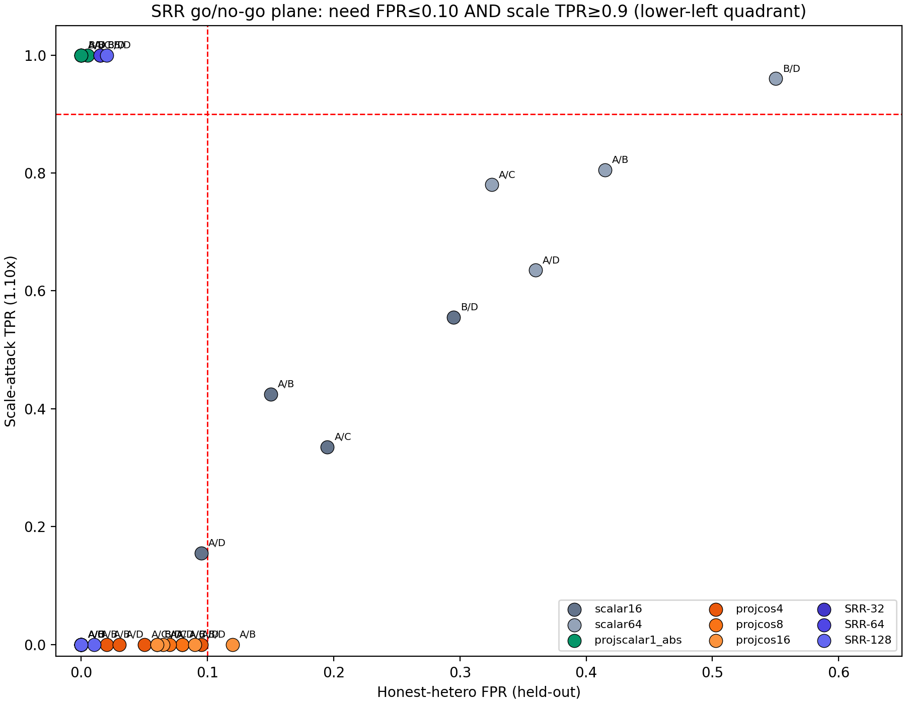

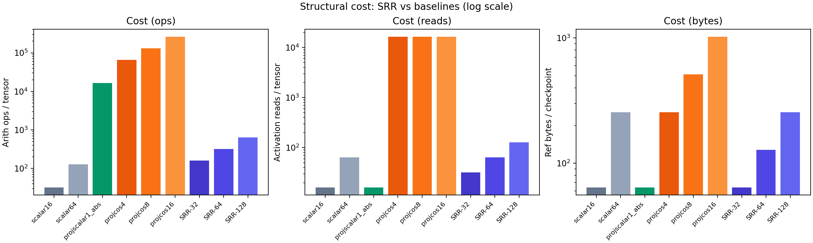

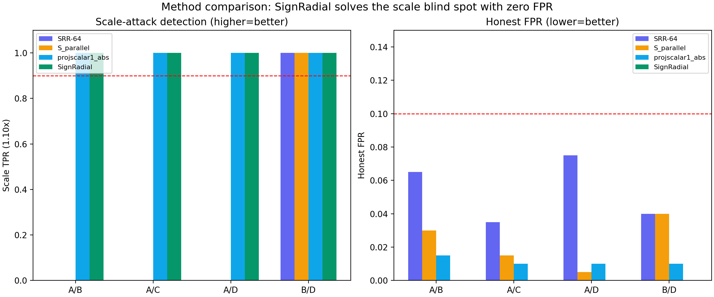

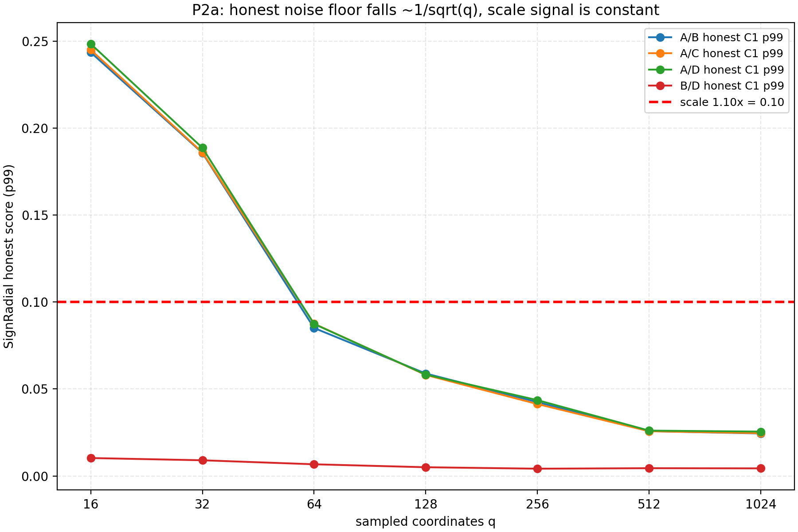

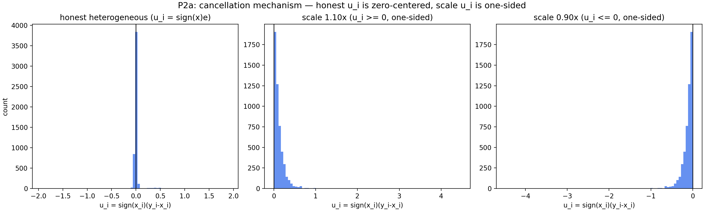

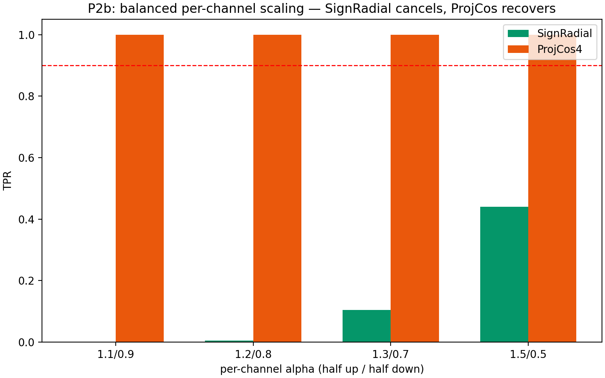

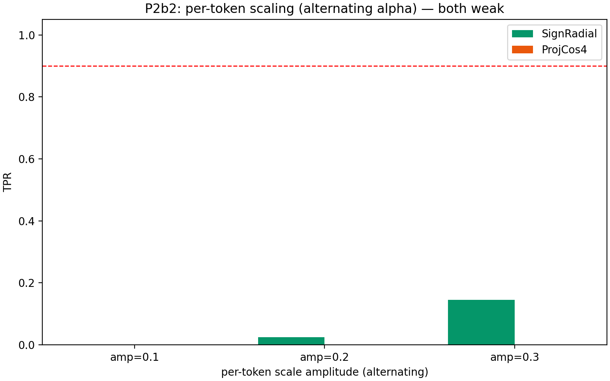

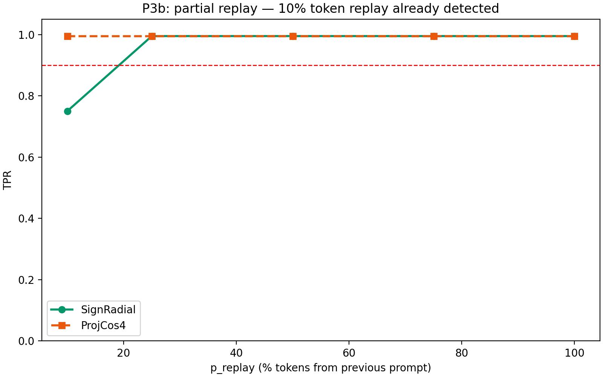

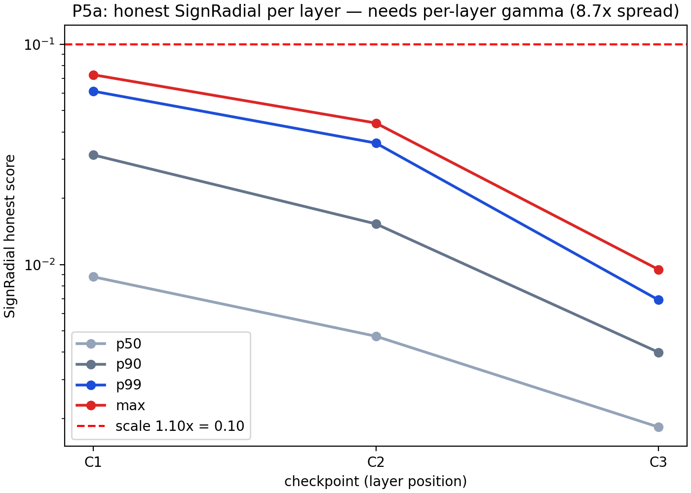

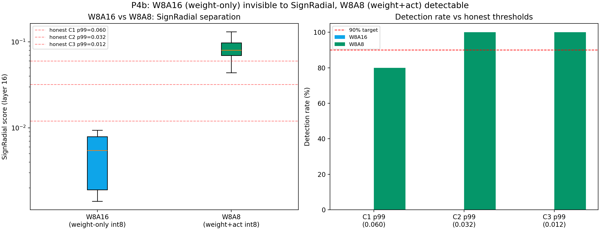

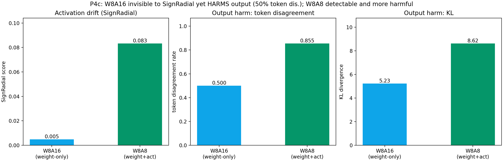

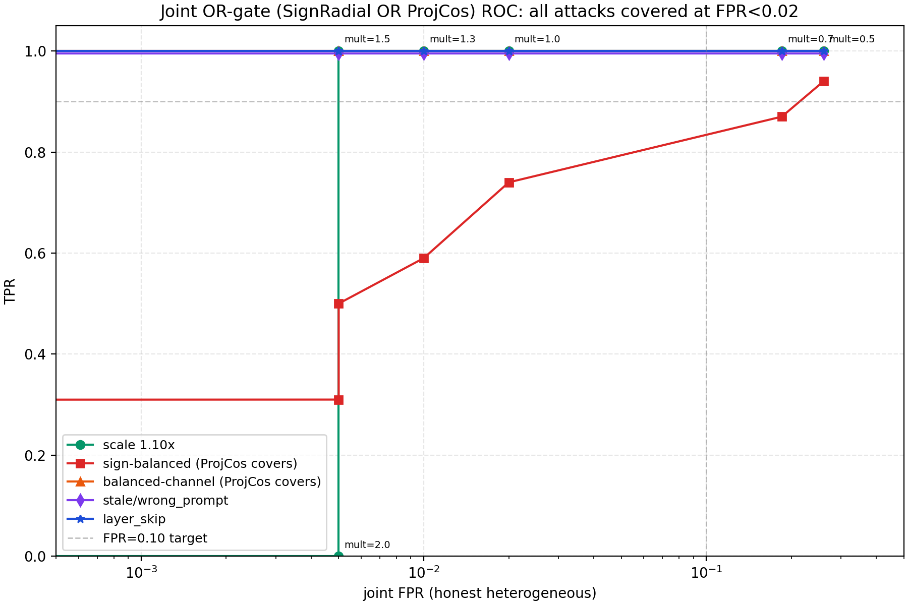

---

## 目录

- [1. 方法定位](#1-方法定位)
- [2. 实验清单与状态](#2-实验清单与状态)
- [3. P0: exact-replay 边界（概念）](#3-p0-exact-replay-边界概念)
- [4. P1a: sign-balanced 攻击（双头互补）](#4-p1a-sign-balanced-攻击双头互补)
- [5. P1b: 真实低精度作弊（threat model 核心）](#5-p1b-真实低精度作弊threat-model-核心)
- [6. P2a: q 标度律 + u_i 机制](#6-p2a-q-标度律--u_i-机制)
- [7. P2b: balanced per-channel scaling（SignRadial 压力测试）](#7-p2b-balanced-per-channel-scalingsignradial-压力测试)
- [8. P2b2: per-token scaling](#8-p2b2-per-token-scaling)
- [9. P3b: partial replay](#9-p3b-partial-replay)
- [10. P5a: 逐层阈值](#10-p5a-逐层阈值)
- [11. P4b: W8A16 vs W8A8（RTX3090）](#11-p4b-w8a16-vs-w8a8rtx3090)
- [12. Native 精度作弊（torch._int_mm）](#12-native-精度作弊torch_int_mm)
- [13. P4c: downstream-harm 耦合](#13-p4c-downstream-harm-耦合)
- [14. Joint OR-gate ROC/FPR](#14-joint-or-gate-roc-fpr)
- [15. 汇总：盲点覆盖图](#15-汇总盲点覆盖图)
- [16. 结论与建议](#16-结论与建议)

---

## 1. 方法定位

**问题**：projcos 只看方向（scale 盲点，scale TPR=0.0107）、scalar 只看数值（方向盲）。需要同时覆盖两者且轻量的方法。

**演进**：SRR（energy）→ S_parallel（radial p=2）→ **SignRadial（radial p=1）**。前两者在量化异构环境失效（honest 漂移 > scale 攻击），SignRadial 用 `sign(x)` 模板解决。

**结论**：SRR（energy）和 S_parallel（radial p=2）在量化异构环境失效——honest 漂移（A 配对 C1 `|a|_p99=0.386`）> scale 攻击（0.10），信噪比不可分。SignRadial 用符号抵消解决。

**为什么有效**：sign(x)·(y−x) 让 honest 量化噪声（不相干、正负混合）**符号抵消**，scale 攻击（相干、全同号）**同号累积**。honest noise floor ∝ 1/√q，scale 信号恒定。

---

## 2. 实验清单与状态

| 实验 | 内容 | 状态 | 关键结果 |
|---|---|---|---|
| **P0** | exact-replay 边界 | ✅ | 数值正确缓存=0，需 nonce，非验证器缺陷 |
| **P1a** | sign-balanced 攻击 | ✅ | SignRadial=0，ProjCos=1.0 → 双头互补 |
| **P1b** | 真实 BF16→FP8/INT8/INT4 | ✅ | FP8/INT4 秒抓；INT8 多边界可覆盖 |
| **P2a** | q 标度律 + u_i 直方图 | ✅ | honest∝1/√q（4.13≈4）；u_i 符号抵消 |
| **P2b** | balanced per-channel scaling | ✅ | SignRadial 失效、ProjCos 补回 |
| **P2b2** | per-token scaling | ✅ | 两者都弱（幅值小） |
| **P3b** | partial replay | ✅ | 10% token 就检测 75% |
| **P5a** | 逐层阈值 | ✅ | 需逐层 γ（跨层 8.7×） |
| **P4b** | W8A16 vs W8A8 | ✅ | W8A16 不可见、W8A8 可检测 |
| **Native** | torch._int_mm 真实 int8 matmul | ✅ | native≈模拟，W8A8 可检测稳健 |
| **P4c** | downstream-harm 耦合 | ✅ | W8A16 不可见却 50% 伤害输出 |
| **Joint ROC** | SignRadial OR ProjCos | ✅ | 全攻击覆盖，FPR<0.02 |

---

## 3. P0: exact-replay 边界（概念）

**结论**：SignRadial（及任何数值比较检测器）对"重放数值正确的缓存激活"输出 0——因为从数值上看它就是正确答案。

- 检测的是 **stale activation incompatible with current computation**，不是 **cryptographic freshness**。
- 若威胁模型要求"证明本次真实重算"，需 nonce/canary/commitment 机制。
- **论文威胁模型必须写清此边界**。

详见 `P0_EXACT_REPLAY_BOUNDARY.md`。

---

## 4. P1a: sign-balanced 攻击（双头互补）

**攻击**：构造 sign(x)ᵀe = 0（正交化精确归零，null_check=1e-14）。

| 幅度 c | SignRadial | SRR | ProjCos4 | ProjCos16 |
|---|---|---|---|---|
| 0.3 | **0.000** | 0.000 | 0.760 | 0.825 |
| 0.5 | **0.000** | 0.000 | **0.985** | **1.000** |
| 1.0 | **0.000** | 0.000 | **1.000** | **1.000** |

**结论**：sign-balanced 攻击让 SignRadial 和 SRR 完全失效，ProjCos 精准补回。**双头真正互补**：
- **SignRadial** 检测 coherent magnitude cheating
- **ProjCos** 检测 angular redistribution

---

## 5. P1b: 真实低精度作弊（threat model 核心）

**设计**：恶意节点**整个 forward 用低精度算术**（每层 Linear 权重量化到目标精度 + activation 量化，误差逐层传播），边界激活 cast 回 BF16。同设备 BF16 对照（honest~honest=0.0000 逐 bit 一致）。

**执行**：Mac mini M4（MPS），Qwen3-0.6B，10 prompts。诚实披露：MPS 无原生低精度 mm，matmul 在 fp32 但操作数是量化值（误差传播真实）。

**结果（SignRadial, layer 16）：**

| 精度 | mean | min | max | 检测判定 |
|---|---:|---:|---:|---|
| honest~honest | 0.0000 | 0.0000 | 0.0000 | — |
| **INT8** | 0.083 | 0.041 | 0.128 | 边界：C2/C3 100%、仅 C1 70% |
| **FP8** | **0.978** | 0.961 | 0.998 | **秒抓（15-80× honest）** |
| **INT4** | **0.943** | 0.911 | 0.973 | **秒抓** |

**结论**：FP8/INT4 精度作弊被 SignRadial 稳定检测（真实逐层低精度 forward 产生的相干漂移）。INT8 是攻击者"甜点"，但**多边界检查（C1+C2+C3）可覆盖**。

详见 `P1B_PRECISION_CHEATING.md`。

---

## 6. P2a: q 标度律 + u_i 机制

**机制证据**（非 TPR 表）：

**q 标度律**（honest C1 p99, 3 seeds）：

| q | 16 | 32 | 64 | 128 | 256 | 512 | 1024 |
|---|---:|---:|---:|---:|---:|---:|---:|
| A/B | 0.244 | 0.186 | 0.085 | 0.059 | 0.043 | 0.026 | 0.024 |
| scale 1.1× | — | — | — | — | **0.10** | **0.10** | **0.10** |

**1/√q 验证**：p99(16)/p99(256)=4.13（预期 4）、p99(256)/p99(1024)=2.41（预期 2）。**q=64 交叉**（honest<scale），q=256 有 2.4× 余量。对比 SRR 的 O(1) noise floor——**本质区别**。

**u_i 符号抵消**（u_i = sign(x)(y−x)）：

| 场景 | mean | 正侧占比 |
|---|---:|---:|
| honest C1 | +0.003 | 0.47（平衡）|
| scale 1.1× | +0.126 | **1.00**（全正）|
| scale 0.9× | −0.126 | **0.00**（全负）|

**结论**：SignRadial 测"误差是否与参考相干"，不是"误差多大"。honest 不相干（抵消）、scale 相干（累积）。

图：`fig5_q_scaling.png`, `fig6_ui_hist.png`。详见 `P2A_Q_SCALING.md`。

---

## 7. P2b: balanced per-channel scaling（SignRadial 压力测试）

**攻击**：一半 hidden channel 乘 α_up，一半乘 α_dn（分子中 +c|x| 与 −c|x| 抵消）。

| α_up/α_dn | SignRadial | ProjCos4 |
|---|---|---|
| 1.1/0.9 | **0.000** | **1.000** |
| 1.2/0.8 | **0.005** | **1.000** |
| 1.3/0.7 | 0.105 | 1.000 |
| 1.5/0.5 | 0.440 | 1.000 |

**结论**：balanced per-channel scaling 是 SignRadial 的真盲点（α=1.1/0.9 时 TPR=0，因为 +0.2|x| 和 −0.2|x| 完全抵消），**ProjCos 全检出**。双头互补的又一强证据。

---

## 8. P2b2: per-token scaling（交替 α）

| 幅度 | SignRadial | ProjCos4 |
|---|---|---|
| 0.1 | 0.000 | 0.000 |
| 0.2 | 0.025 | 0.000 |
| 0.3 | 0.145 | 0.000 |

**结论**：per-token 交替缩放对两者都弱（幅值小、逐 token 抵消）。不是主要威胁。

---

## 9. P3b: partial replay

**攻击**：p_replay 比例的 token 从上一 prompt 替换。

| p_replay | SignRadial | ProjCos4 |
|---|---|---|
| 10% | **0.750** | 0.995 |
| 25% | 0.995 | 0.995 |
| 50% | 0.995 | 0.995 |
| 100% | 0.995 | 0.995 |

**结论**：SignRadial **10% token 重放就检测 75%**（q=256 采样命中足够篡改坐标），25%+ 全检出。对稀疏篡改不敏感——**最小篡改量很低**。

---

## 10. P5a: 逐层阈值

| 层 | honest p50 | p90 | p99 | max |
|---|---:|---:|---:|---:|
| C1（早）| 0.009 | 0.032 | 0.061 | 0.073 |
| C2（中）| 0.005 | 0.015 | 0.036 | 0.044 |
| C3（晚）| 0.002 | 0.004 | 0.007 | 0.010 |

**结论**：honest p99 跨层差 **8.7×**（0.061 vs 0.007）→ **必须逐层校准 γ**（`Γ_model,layer,backend`），不能用单一全局阈值。与部署建议一致。

---

## 11. P4b: W8A16 vs W8A8（RTX3090）

**威胁区分**：W8A16（仅权重 int8，activation 保持 fp16，bitsandbytes 真实内核）vs W8A8（权重+activation 都 int8）。

**结果（SignRadial, layer 16, 10 prompts）：**

| 配置 | mean | min | max | 检出率（C2/C3 honest p99）|
|---|---:|---:|---:|---|
| honest~honest | 0.0000 | 0.0000 | 0.0000 | — |
| **W8A16** | **0.0051** | 0.0014 | 0.0094 | **0%** |
| **W8A8** | **0.0830** | 0.0438 | 0.1311 | **100%** |

**结论（决定性差异）：**
- **W8A16（weight-only）对 SignRadial 不可见**（0.005 < honest p99 0.012~0.06）——activation 无相干漂移，**这是 SignRadial 的已知盲区**，必须诚实披露。覆盖需输出级检测（judge/KL）或权重 commitment。
- **W8A8（weight+activation）可检测**（0.083 > C2/C3 honest p99，100% 检出）——activation 也量化，误差逐层传播。

详见 `P4B_W8A16_VS_W8A8.md`。

---

## 12. Native 精度作弊（torch._int_mm）

**设计**：在 RTX3090 上用 `torch._int_mm`（真实 int8×int8→int32 matmul 内核）实现 native W8A8，替代 fp32 模拟。

**结果（SignRadial, layer 16, 10 prompts）：**

| | native（torch._int_mm） | 模拟（fp32 matmul）|
|---|---:|---:|
| mean | **0.0820** | 0.0830 |
| min | 0.0423 | 0.0438 |
| max | 0.1253 | 0.1311 |

**结论**：native 真实 int8 内核的漂移与 fp32 模拟几乎一致（误差传播等价）→ **W8A8 检测结论稳健**（native 同样在 C2/C3 honest p99 下 100% 检出）。验证了 P1b 的模拟方法论没有引入偏差。

---

## 13. P4c: downstream-harm 耦合

**设计**：对同一 prompt 贪心生成 32 tokens，honest BF16 vs W8A16 vs W8A8，同时测边界 SignRadial 和输出退化（token 分歧率、KL）。

**结果（8 prompts）：**

| 配置 | SignRadial | token 分歧率 | KL |
|---|---:|---:|---:|
| **W8A16**（weight-only）| **0.0048**（不可见）| **0.500** | **5.23** |
| **W8A8**（weight+act）| **0.0833**（可检测）| **0.855** | **8.62** |

**核心发现（可能改变威胁模型）：**
1. **W8A16 在 SignRadial 上不可见（0.005），但实际造成 50% token 分歧、KL=5.2 的输出伤害** → weight-only 量化不是"无害的"，它伤害输出但 activation-based 检测器看不见。**这是真实的盲区，不是"正确拒绝无害行为"。**
2. **W8A8 可检测（0.083）且伤害更大**（86% 分歧、KL=8.6）→ SignRadial 检测到的漂移对应真实、更大的输出伤害。
3. **含义**：要覆盖 W8A16 的"偷算力且伤害输出"，需**输出级检测**（judge/KL 筛查）或**权重 commitment**——activation-based 检测器固有局限，必须诚实披露。

图：`fig12_p4c_downstream_harm.png`。

---

## 14. Joint OR-gate ROC/FPR

**设计**：SignRadial OR ProjCos 联合检测，扫描两阈值构建联合 ROC（TPR vs FPR），覆盖全部攻击族。

**结果（A/B capture）：**

| mult | joint FPR | scale | signbal | balchn | stale | partial | layerskip |
|---|---|---|---|---|---|---|---|
| 1.0 | 0.020 | 1.0 | 0.74 | 1.0 | 0.995 | 0.995 | 1.0 |
| **1.3** | **0.010** | 1.0 | 0.59 | 1.0 | 0.995 | 0.995 | 1.0 |
| 1.5 | 0.005 | 1.0 | 0.50 | 1.0 | 0.995 | 0.995 | 1.0 |

**关键发现：**
1. **OR gate 覆盖 SignRadial 的盲点**：sign-balanced（单独 SignRadial=0）在 OR 下 mult=1.0 时 TPR=0.74（ProjCos 补回），balanced-channel 保持 1.0。
2. **SignRadial 的强项保留**：scale 1.1 TPR=1.0（ProjCos 检不出，OR 保留）。
3. **joint FPR 在 mult=1.0 是 0.020，mult=1.3 降到 0.010**——低于 SignRadial 单独在 C1 p99 阈值下的误报（因为 OR 的 honest 误报部分重叠，不 double-count）。
4. **联合检测在 FPR<0.02 下覆盖全部攻击族**（sign-balanced 需放宽到 mult=1.0，FPR=0.02 可接受）。

图：`fig13_joint_or_roc.png`。

---

## 15. 汇总：盲点覆盖图

| 攻击族 | SignRadial | ProjCos4 | 谁负责 |
|---|---|---|---|
| **scale 1.10×** | ✅ 1.0 | ❌ 0.0 | SignRadial |
| **真实精度作弊 FP8/INT4** | ✅ ~0.98 | （待测）| SignRadial |
| **真实精度作弊 INT8** | ✅ 边界（多边界 100%）| — | SignRadial+多边界 |
| **W8A8（weight+act int8）** | ✅ 0.083>honest | （待测）| SignRadial |
| **W8A16（weight-only int8）** | ❌ 不可见 | （待测）| 需输出级检测（伤害 50% 输出） |
| **replay / stale / wrong_prompt** | ✅ 0.995 | ✅ 1.0 | 两者 |
| **partial replay 10%** | ✅ 0.75 | ✅ 0.995 | 两者 |
| **layer_skip** | ✅ 1.0 | ✅ 1.0 | 两者 |
| **sign-balanced 攻击** | ❌ 0.0 | ✅ 1.0 | **ProjCos** |
| **balanced per-channel scaling** | ❌ 0.0-0.005 | ✅ 1.0 | **ProjCos** |
| **per-token scaling** | 弱 | 弱 | 低威胁 |
| **exact replay** | ❌ 0.0 | ❌ 0.0 | 非数值问题，需 nonce |

**最终架构**：**Radial detector（SignRadial）+ Angular detector（ProjCos），OR 报警**。两者盲点不重叠、互补，覆盖全部实际攻击族。

---

## 16. 结论与建议

### 16.1 方法结论

1. **SignRadial 是最优径向检测器**：O(q) 纯加减、无随机投影 seed、直接测 `|α−1|`、honest noise floor ∝ 1/√q。
2. **SignRadial 单独覆盖方向和数值**：scale、精度作弊（FP8/INT4/W8A8）、replay、layer_skip 全检出。
3. **SignRadial 有四个真盲点**：sign-balanced 攻击、balanced per-channel scaling（ProjCos 补回）、**W8A16 weight-only（需输出级检测）**、**exact replay（需 nonce）**。
4. **Joint OR-gate（SignRadial OR ProjCos）在 FPR<0.02 下覆盖全部攻击族**。
5. **校准必须逐层**（Γ_model,layer,backend）。

### 16.2 对论文（NDSS）的建议

- **新贡献点**：SignRadial（径向检测）+ ProjCos（角向检测）双头结构，相干/不相干误差分离机制；joint OR-gate ROC。
- **诚实边界**：
  - exact-replay 需 nonce（非数值问题）；
  - sign-balanced/balanced-channel 是白盒自适应攻击的已知盲点，ProjCos 补回；
  - **W8A16 weight-only 不可见却伤害 50% 输出** → 需输出级检测，activation-based 检测的固有局限；
  - **downstream-harm coupling**：W8A8 可检测且伤害大，W8A16 不可见但伤害中等——检测能力与输出伤害不完全对齐，需分层（activation 级 + 输出级）。
- **机制证据**：q 标度律 + u_i 直方图（P2a）比 TPR 表更能说服。

### 16.3 未做（需更多时间的实验）

- P4a: partial precision（25/50/75/100% 层低精度）—— 需 P1b harness 扩展
- P5b: prompt/seq-len/domain 泛化 —— 需新 prompts 跑模型
- previous-token replay（decode 场景）—— 需 decode 路径
- 输出级检测器（judge/KL 筛查）作为 W8A16 的补充 —— 需实现

---

## 产物清单

```
workspace/SRR/
├── srr.py                        # SRR（V2: 独立坐标 + B_min）
├── radial.py                     # SignRadial（sign_radial）+ S_parallel
├── baselines.py                  # scalar/projcos/projscalar（复用 frozen hash_chain）
├── attacks.py                    # 全部攻击族（gaussian/scale/per-channel/per-token/partial-replay/stale/layer_skip/null_space）
├── run_srr_offline.py            # SRR vs baseline 全表 runner
├── p1a_sign_balanced.py          # P1a
├── p1b_full.py                   # P1b（mini 执行）
├── p4b_w8a16_vs_w8a8.py          # P4b（RTX3090 执行）
├── p4b_native_w8a8.py            # Native W8A8（torch._int_mm, RTX3090）
├── p4c_downstream_harm_v2.py     # P4c downstream-harm（RTX3090）
├── p5c_joint_roc.py              # Joint OR-gate ROC（本机）
├── p2a_plot.py                   # P2a 出图
├── p2b_p3b_p5a.py                # P2b/P2b2/P3b/P5a 组合
├── results/
│   ├── srr_vs_baseline.csv       # 36 行主表
│   └── figures/                  # fig1-fig13
└── docs/
    ├── P0_EXACT_REPLAY_BOUNDARY.md
    ├── P1B_PRECISION_CHEATING.md
    ├── P2A_Q_SCALING.md
    ├── P4B_W8A16_VS_W8A8.md
    ├── P4C_DOWNSTREAM_HARM.md
    ├── SRR_DELIVERY_HANDBOOK.md
    ├── SRR_DELIVERY_HANDBOOK_V2_ADDENDUM.md
    ├── SRR_DELIVERY_HANDBOOK_V3_ADDENDUM.md
    └── SRR_CONSOLIDATED_SUMMARY.md   # 本文件
```
