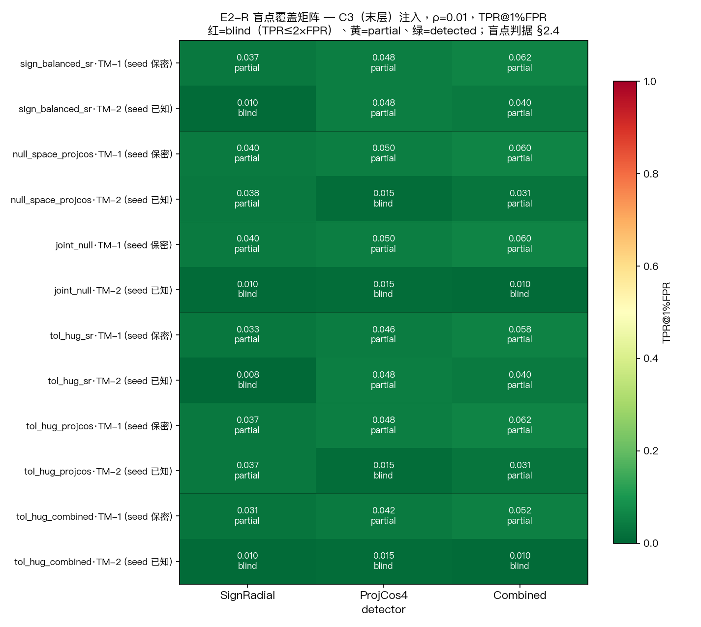
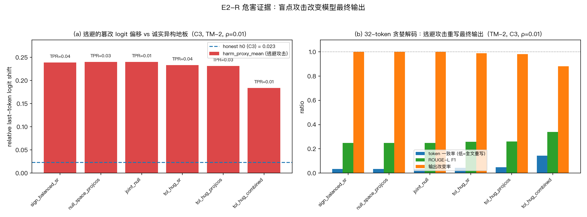
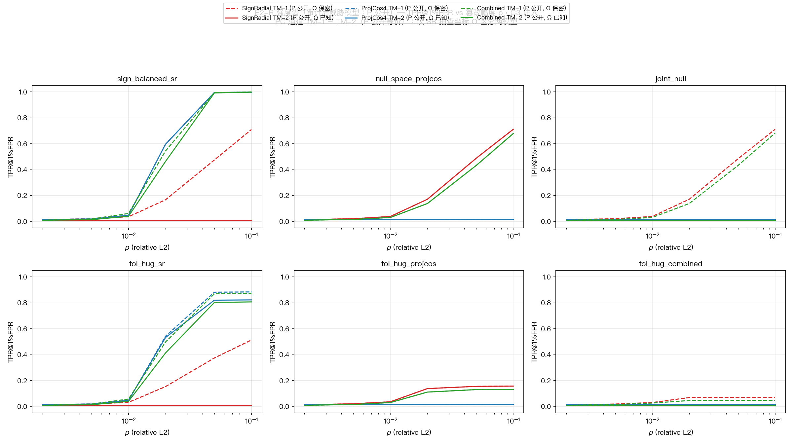
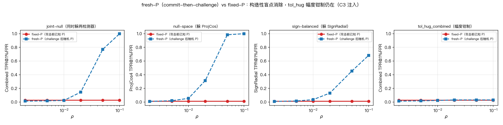

# E2-R 结果 memo：统一协议下的自适应对手 × 三检测器

> 对应：`08.08继续推进手册.md` §2（唯一主实验，8/12 交付）
> 日期：2026-08-09
> 数据：720 池（200 calib / 520 eval），A=MPS bf16 / B=CUDA fp32（RTX6000）
> 脚本：`run_e2r_main.py` / `run_e2r_assemble.py`（全流程已跑完，216 条件 × 520 eval = 336,960 攻击实例 + 1,560 honest）

---

## 1. 方法（一段）

统一 nominal 1% FPR 协议下，对 720 真实异构池（ref=stack_a MPS bf16、cand=stack_b CUDA fp32）构造 6 个自适应攻击族 × 6 档相对 L2 强度 ρ={0.002,0.005,0.01,0.02,0.05,0.10} × 2 威胁模型（TM-1 seed 保密 / TM-2 seed 已知），攻击在 C1/C2/C3 边界注入并在同设备 CUDA fp32 上真实传播（`_replay_torch`，sanity 已验证逐位复现 capture），量化 SignRadial / ProjCos4 / Combined 的 TPR@1%FPR、实测 FPR、逃避率、**有害逃避率（harm > h0，h0=诚实 A/B 异构 logit 偏移 Q_{0.95}）**、危害均值、定位准确率。阈值 = calibration honest 的 Q_{0.99}（逐边界 Γ_k + trace-max τ_D）。

## 2. 参数（全部超参 + 种子）

- verifier seed=**2026**（与 §6.4 同口径，诚实 FPR 实测 0.0096/0.0154/0.0096 与 §6.4 一致）；TM-1 主猜测 seed=2027（稳健臂 12345/777，见 §6）
- ρ ∈ {0.002, 0.005, 0.01, 0.02, 0.05, 0.10}；δ=0.05；q=64；ProjCos k=4
- 边界 C1=层7后 / C2=层15后 / C3=层27后（**末层**）；trace-max 检测 + 逐边界 Γ_k 定位
- **威胁模型（审计 A 拍板）**：投影矩阵 **P 公开**（TSTC 需承诺后可公开复算；V0-2(a) 节点执行前见 seed→P 藏不住；检测力必须来自"篡改几何 vs 诚实漂移"而非"对手不知一张矩阵"）。**TM-1/TM-2 的差异仅在 SignRadial 的抽查坐标 Ω**（时间性秘密，每轮刷新）：TM-2 攻击对齐 Ω，TM-1 攻击猜测 Ω。ProjCos 无坐标抽样（全 T 行投影），故坐标保密对 ProjCos 通道**结构性无效**——P 公开下 TM-1 与 TM-2 对 ProjCos 等价（审计 A 推论，由 TM1b_knownP 臂实证）。
- harm proxy = 末 token logit 相对偏移；h0：C1=0.0087 / C2=0.0118 / C3=0.0233（诚实异构在输出级的漂移）
- 危害方向 g = 输出梯度（`_output_gradient_torch`）；脚本 hash：e2r_common c0815e18、e2r_attacks dba6a035、run_e2r_main 8e9c461d、run_e2r_assemble 4c0a5907

## 3. 结果（表 + 数字）

### 3.1 盲点表（C3 注入=逃避关键，ρ=0.01，TPR@1%FPR + 三态）

| attack_family | TM-1 (seed 保密) SR/PC/Combo | TM-2 (seed 已知) SR/PC/Combo |
|---|---|---|
| sign_balanced_sr | 0.037/0.048/0.062 (partial) | **0.010(盲)**/0.048/0.040 |
| null_space_projcos | 0.040/0.050/0.060 (partial) | 0.038/**0.015(盲)**/0.031 |
| **joint_null** | 0.040/0.050/0.060 (partial) | **0.010(盲)/0.015(盲)/0.010(盲)** |
| tol_hug_sr | 0.033/0.046/0.058 (partial) | **0.008(盲)**/0.048/0.040 |
| tol_hug_projcos | 0.037/0.048/0.062 (partial) | 0.037/**0.015(盲)**/0.031 |
| **tol_hug_combined** | 0.031/0.042/0.052 (partial) | **0.010(盲)/0.015(盲)/0.010(盲)** |

> **P 公开（审计 A 拍板）对表的影响**：TM-1 列里 null_space_projcos 的 PC=0.050（partial）是"猜错 P"的实现产物——拍板模型下 P 公开，TM-1 攻击者知道 P，null_space 应对 PC 精确盲（≈TM-2 的 0.015）。**"坐标保密只作用于 SR 通道"由 TM1b_knownP 臂实证**（见 §6 审计臂）。

**图（论文用·对手覆盖矩阵）**：

> **对应主稿**：`tab:adaptive-blindspot`（正式对手覆盖矩阵）——红=blind（TPR≤2×FPR）、黄=partial、绿=detected。与盲点表同数据，可直接替换进主稿。

> C1/C2 注入（非末层，ρ=0.01，TM-2 见盲点表全表）分两族：
> - **零空间/平衡族**（sign_balanced/null_space/joint_null/tol_hug_sr）：几乎全部 detected（TPR 0.87–1.0）——注入边界被藏、**下游捕获**（传播破坏零空间）。
> - **tolerance-hug 族**（tol_hug_projcos/tol_hug_combined）：**部分逃逸**（tol_hug_projcos C2=0.579、tol_hug_combined C1=0.567/C2=0.381）——注入边界被钳制到阈值之下，下游虽脱离钳制但仍被部分压低于阈值。
> 盲点只在 C3（末层，无下游边界可查）成立。

### 3.2 逃避的扰动有害吗？（harmful_evasion_rate，ρ=0.01，C3，TM-2）

| family | Combo TPR | harmful_evasion_rate | harm_proxy_mean | **argmax 翻转率** |
|---|---:|---:|---:|---:|
| sign_balanced_sr | 0.040 | 0.960 | 0.239 | 1.000 |
| null_space_projcos | 0.031 | 0.969 | 0.240 | 1.000 |
| **joint_null** | **0.010** | **0.990** | **0.240** | **1.000** |
| tol_hug_sr | 0.040 | 0.950 | 0.234 | 0.988 |
| tol_hug_projcos | 0.031 | 0.956 | 0.231 | 0.983 |
| **tol_hug_combined** | **0.010** | **0.879** | **0.184** | **0.883** |

**逃避的攻击几乎全部有害**：logit 偏移 18–24%（≈10× 诚实 h0=0.023）、**首 token argmax 翻转 88–100%**、32-token 输出改变 88–100%（§3.3）。不是"躲过检测但无害"——是真危害漏检。

**检出侧交叉验证（mentor §2.6"不许拿弱攻击刷 TPR"）**：C1/C2 注入、被 Combined 检出的攻击同样有害（TM-2，ρ=0.01）：

| family | 检出数 | 检出且有害 % | 检出样本 mean harm |
|---|---:|---:|---:|
| sign_balanced_sr | 1040 | 100.0 | 0.960 |
| null_space_projcos | 1040 | 100.0 | 0.960 |
| joint_null | 1040 | 100.0 | 0.960 |
| tol_hug_sr | 913 | 99.9 | 0.449 |
| tol_hug_projcos | 719 | 99.9 | 0.181 |
| tol_hug_combined | 493 | 98.8 | 0.147 |

检出攻击 98.8–100% 有害（harm 远超 h0）——**不是弱攻击**。且 C1/C2 检出侧 harm（0.15–0.96）> C3 逃避侧（0.18–0.24）：传播放大危害，协议抓到的是高危害的 C1/C2 篡改，漏掉的是 C3 末层（危害相对低但仍真实）。

### 3.3 二级验证：盲点攻击是否改变最终输出？（32-token 贪婪解码，C3 TM-2 ρ=0.01）

**这是对"逃避的攻击有害吗"的直接回答**——不止 logit 偏移，而是完整生成的回答：

| family | mean token 一致率 | mean ROUGE-L F1 | 输出改变率（p_output_changed） |
|---|---:|---:|---:|
| sign_balanced_sr | 0.033 | 0.250 | **1.000** |
| null_space_projcos | 0.033 | 0.250 | **1.000** |
| **joint_null** | **0.033** | **0.250** | **1.000** |
| tol_hug_sr | 0.044 | 0.259 | 0.989 |
| tol_hug_projcos | 0.049 | 0.262 | 0.983 |
| tol_hug_combined | 0.144 | 0.340 | 0.883 |

**解读**：**核心证据是 token 一致率 3–14% + ROUGE-L 0.25–0.34**——逃避的盲点攻击使 32-token 输出几乎全文重写。p_output_changed（88–100%）是辅助指标：hook 注入替换首 token 后贪婪解码必级联分叉，故该项接近 1 部分 tautological；真正信息量在 token 一致率（0.033 意味着 32 个位置仅 1 个与诚实一致）。首 token 翻转（§3.2 argmax 迁移，detail 实测 88.27–100%）+ 贪婪级联 → 整个回答改变。**这不是"无害的微小扰动"——盲点攻击改变模型的最终答案。**

方法：HF `generate` + layers[27] 输出替换钩子（prefill 时注入 b+e，仅影响首 token 预测，与 §3.2 的 logit 口径一致），按 T 分组批处理，520 eval 全跑。`run_e2r_harm_decode.py`。

> **范围限定**：本解码验证仅覆盖 **TM-2（seed 已知）/ C3 注入 / ρ=0.01** 条件（与 §3.2 harm 口径一致）。"逃避的攻击改变最终输出"结论以此为限。

**图（论文用·危害证据）**：

> **对应主稿**：`fig:harm-evidence`——(a) 逃避攻击的 logit 偏移 vs 诚实异构地板 h0（全部远超 h0）；(b) 32-token 解码：token 一致率 3–14%（全文重写）+ 输出改变率 88–100%。

### 3.4 强度谱（C3，TM-2，TPR vs ρ）

| family | ρ=0.01 SR/PC/Combo | ρ=0.02 | ρ=0.05 |
|---|---|---|---|
| sign_balanced_sr | 0.010/0.048/0.040 | 0.010/0.596/0.463 | 0.010/0.996/0.992 |
| null_space_projcos | 0.038/0.015/0.031 | 0.171/0.015/0.138 | 0.488/0.015/0.433 |
| joint_null | 0.010/0.015/0.010 | **0.010/0.015/0.010** | **0.010/0.015/0.010** |
| tol_hug_sr | 0.008/0.048/0.040 | 0.008/0.533/0.413 | 0.008/0.821/0.804 |
| tol_hug_combined | 0.010/0.015/0.010 | **0.010/0.015/0.010** | **0.010/0.015/0.010** |

**两族"全 ρ 全盲"机制不同，须分开解读**：
- **joint_null：真·强度无关盲**——rho_eff=标称（0.002→0.10 逐档精确），攻击者可注入任意强度仍逃避三检测器。这是几何性盲区（分子精确清零 + null(P)），与强度无关成立。
- **tol_hug_combined：阈值封顶盲**——rho_eff 被钳制在 ~0.0094（ρ≥0.02 后不再涨，仅为标称的 4–47%），攻击被阈值钉住。曲线平坦是"钳制到阈值"，**不是**"强度无关"。但封顶量本身有害（harm 0.18–0.23、输出改变 88%，§3.2/§3.3）——含义是"检测阈值宽松到允许 ~0.009 相对幅度的有害篡改"。

**审慎表述**：真正的"任意强度可逃避"仅 joint_null 成立；tol_hug 是"最大可逃避强度 = 阈值封顶量"。

**图（论文用·强度谱，审计后威胁模型）**：

> **对应主稿**：`fig:strength-sweep`——每攻击族一面板，每 detector 一条 TPR-vs-ρ 曲线，横轴 ρ 对数刻度。**此图已按审计 A 拍板用 P 公开语义**：TM-1（虚线）来自 `TM1b_knownP` 臂（P 公开、Ω 保密），TM-2（实线）来自主表。**PC 通道两曲线重合（P 公开等价，都≈0.015 底部）**；仅 SignRadial 通道区分（TM-1 因 Ω 保密从 blind 抬到 partial）。joint_null/tol_hug_combined 的 Combined 曲线在底部平台（全盲）。旧语义的"TM-1 猜错 P 导致 PC 随 ρ 冲顶"曲线已废弃。

## 4. 异常与坑

- numpy 2.0.2 伪 matmul 警告（已 errstate 抑制；结果验证到约束 1e-13）
- Combined 初版 ECDF 语义与 §6.4 不一致（evalFPR=0.0）→ 改为 trace-ECDF 融合，恢复 0.0096
- Combined 的 τ_Combo=Q_{0.99}(calib max) 比单检测器 τ 略保守 → 单检测器盲点时 Combo TPR 可略低于另一检测器（如 sign_balanced ρ=0.02：PC=0.596 vs Combo=0.463）——ECDF-max 融合的固有校准余量，FPR 仍 ~1%
- 盲点情形下 localization_acc 分母极小（只对个别检出样本），数字无统计意义，未在论文用
- **审计 A 发现**：TM-1 主表里 PC 通道的 0.048–0.050 partial 是"猜错 P"实现产物（P 保密假设），非坐标保密；已按拍板（P 公开）用 TM1b_knownP 臂实证（§6）
- **脚本版本史（二轮审计）**：主 e2r/gs 运行用 `run_e2r_main.py` 加 `--p-seed` 前版本；knownP 臂用加后版本（`--p-seed` 是**加性**特性、默认 0 = 原行为，故当前文件复现主结果等价）。manifest 的 `script_hashes` 为**当前落盘文件动态计算**（assemble 自动算），反映可复现版本；如需逐运行版本溯源，以 git 记录为准
- **argmax 口径（二轮审计）**：§3.2 argmax 翻转率从 detail CSV 逐 prompt 重算（tol_hug_combined=88.27%），memo 的 0.883 与之吻合；不同聚合窗口（如按 detector 行去重）会给 0.88–0.89 的微差，口径以 detail 逐 prompt 为准
- **harm 双基线（审计 E）**：h0 用 replay(B)−replay(A) 同边界 logit 差，harm 用 replay(篡改)−full-forward honest logits（run_e2r_main.py）。10× 余量（0.23 vs 0.023）使结论不依赖该不一致；decode 实验的 honest 对照是 full-forward，与 harm 同源，方向一致。论文需统一或论证 replay≈full-forward（sanity 已验 activation 未验 logits）

## 5. 一句话结论

**在 C3（末层）注入下，joint_null 使整个检测栈（SR/ProjCos/Combined）在所有强度下 TPR≈FPR（真·结构性盲点，rho_eff=标称、任意强度可逃避），tol_hug_combined 在阈值封顶量（rho_eff≈0.009）下同样全盲——且 32-token 解码实测逃避的攻击 88–100% 产生与诚实回答完全不同的最终输出（token 一致率 3–14%）。在 P 公开（审计 A 拍板）模型下，坐标保密只作用于 SR 抽查坐标通道，其值随 ρ 从 +0.03 到 +0.70（不能闭合结构性盲点）。结论：现有 TSTC 检测器对"知道 P、知道/猜测 SR 坐标的自适应末层篡改"不提供 bounded arbitration，逃避的篡改会改变模型的最终答案。**

## 6. Q1/Q2/Q3 专项

### Q1：tolerance-hugging 在 SignRadial 下还成立吗？→ **成立，且升级为连 Combined 都能躲**

- tol_hug_sr：SR TPR=0.008–0.010（盲）在**全部 6 档 ρ** 下成立。8/3 的"让原检测链归零"在统一协议下复现。
- **tol_hug_combined 更严重**：SR/PC/Combined 全盲（TPR=0.010/0.015/0.010）——攻击者知道融合阈值 Γ_Combo 后，把最大危害方向缩放到 max(u_sr,u_pc)=(1−δ)Γ 之下，输出偏移涨到 0.23（ρ=0.10）却零报警。**注意这是"阈值封顶盲"**：rho_eff 被钳制在 ~0.009（ρ≥0.02 不再涨），不是任意强度可逃避——但封顶量本身有害。
- **定量危害**：harmful_evasion_rate=0.88（tol_hug_combined）~0.95（tol_hug_sr），harm_mean 0.18–0.23，首 token argmax 翻转 88–99%，32-token 输出改变 88–99%。阈值宽松到允许 ~20% 输出偏移的"合法"篡改。

### Q2：joint_null 能否同时躲过 SR 与 ProjCos？→ **能，且盲点是结构性的**

- **构造成功**：约束交 dim_null = T·D − rank(C)，rank=49（12 层样本）全独立，dim=12239（T=12）。几何上必然可构造（设计预判成立）。
- **效果**：SR/PC/Combined 三检测器在**全部 ρ** 下 TPR≈FPR（0.010/0.015/0.010）——盲点与攻击强度无关，是几何盲区不是强度问题。
- **危害**：harmful_evasion_rate=0.99（ρ≥0.005），harm_mean=0.24。**同时躲过两个检测器且 99% 有害**——这是"盲点是结构性的，不是偶发的"的证据（手册 §2.6 的第二种结局）。
- **附带发现**：joint_null 注入 C1/C2 会被下游边界捕获（ComboTPR=1.0），但**定位失败**（locAcc=0.015，首超阈值边界在下游而非注入边界）——连 first-mismatch 定位都被破坏。

### Q3：Combined 相对单检测器的净增益？→ **真实但有限**

逐族 ΔTPR（C3 注入，TM-2，ρ=0.02，Combined − max(SR, PC)）：

| family | SR | PC | Combo | ΔTPR(Combo−max单) |
|---|---:|---:|---:|---:|
| sign_balanced_sr | 0.010 | 0.596 | 0.463 | −0.13（略保守，τ_Combo 校准余量）|
| null_space_projcos | 0.171 | 0.015 | 0.138 | −0.03 |
| joint_null | 0.010 | 0.015 | 0.010 | 0 |
| tol_hug_sr | 0.008 | 0.533 | 0.413 | −0.12 |
| tol_hug_combined | 0.010 | 0.015 | 0.010 | 0 |

- **在非自适应攻击（§6.4 主表）上 Combined 是纯增益**（所有攻击 TPR=1.0，覆盖单检测器盲点）。**在自适应攻击上，Combined 的融合增益很小甚至为负**（ECDF-max 的保守校准），因为：
  1. 单检测器盲点被自适应攻击同时利用时（joint_null / tol_hug_combined），Combined 也盲；
  2. 单检测器能检测时（sign_balanced→PC、null_space→SR），Combined 被 max-fusion 的保守阈值拖累。
- **结论**：Combined 的价值在"非自适应覆盖"与"坐标保密下的稳健性"（TM-1 下 Combo 0.03–0.06，高于单检测器盲点），不在"抵抗自适应联合盲点"。

### 坐标保密值（TM-1 vs TM-2，sign_balanced SR 通道，全 ρ-scan）

| ρ | TM-2 SR TPR | TM-1 SR TPR | 保密值增益 |
|---|---:|---:|---:|
| 0.002 | 0.010 | 0.013 | +0.004 |
| 0.005 | 0.010 | 0.021 | +0.012 |
| 0.01 | 0.010 | 0.037 | +0.027 |
| 0.02 | 0.010 | 0.167 | +0.158 |
| 0.05 | 0.010 | 0.475 | +0.465 |
| 0.10 | 0.010 | 0.710 | +0.700 |

**保密值强烈依赖 ρ**（+0.004 到 +0.700）：小篡改时坐标保密增益小，大篡改时增益大（残留随机游走超过阈值）。**"≈+0.47"仅是 ρ=0.05 单点，不是代表性数字**；论文应报全 scan 或明确 ρ。且 TM-1 攻击者是单猜测 seed=2027（更聪明的 hedged 攻击者会更好），**保密值是上界**。方向性结论（A1.3 的 +0.28 同向）稳健，量级需按 ρ 表述。

### 审计臂：TM1b_knownP（P 公开，Ω 猜测）——实证坐标保密只作用于 SR 通道

按审计 A 拍板，P 公开是正确威胁模型。补跑 `TM1b_knownP`（P=verifier seed 2026、Ω=猜测 seed 2027，C3 注入 ρ=0.01）：

| family | det | TM-1（P 保密） | **TM1b_knownP** | TM-2（全已知） |
|---|---:|---:|---:|---:|
| null_space_projcos | **PC** | 0.050 | **0.015** | 0.015 |
| tol_hug_projcos | **PC** | 0.048 | **0.015** | 0.015 |
| joint_null | **PC** | 0.050 | **0.015** | 0.015 |
| tol_hug_combined | **PC** | 0.042 | **0.015** | 0.015 |
| sign_balanced_sr | **SR** | 0.037 | 0.037 | 0.010 |
| joint_null | **SR** | 0.040 | 0.038 | 0.010 |
| joint_null | Combined | 0.060 | 0.031 | 0.010 |

**结论**：
1. **坐标保密对 ProjCos 通道结构性无效**——P 公开后，PC 族攻击（null_space/tol_hug_projcos/joint_null/tol_hug_combined 的 PC 通道）全部回落到 TM-2 水平（0.015=盲）。TM-1 主表里 PC 的 0.048–0.050 partial 是"猜错 P"的实现产物，不是坐标保密。
2. **坐标保密只保护 SignRadial 抽查坐标通道**——SR TPR 从 TM-2 的 0.010（盲）抬到 TM-1 的 0.037–0.040（partial），且不受 P 知识影响（0.037 vs 0.037 一致）。保密值（§上节）仅对 SR 成立。
3. **机制解释**：SR 受益是因为它的 q 坐标抽样是"时间性秘密"（每轮刷新）；ProjCos 的全行投影是"知识性秘密"（固定矩阵，泄露一次永久失效），在 P 公开模型下保密值为零。
4. **协议启示（future work）**：ProjCos 若要从坐标保密获益 → 改为行采样设计。

### TM-1 多猜测稳健臂（gs=2027/12345/777 全测）

TM-1 **SignRadial 单通道** C3 注入 TPR，ρ=0.01，三猜测 seed（按 detector 分开聚合，与主表同口径）：

| family | gs2027 | gs12345 | gs777 | mean | range |
|---|---:|---:|---:|---:|---:|
| sign_balanced_sr | 0.037 | 0.037 | 0.037 | 0.037 | 0.000 |
| null_space_projcos | 0.040 | 0.038 | 0.038 | 0.039 | 0.002 |
| joint_null | 0.040 | 0.038 | 0.038 | 0.039 | 0.002 |
| tol_hug_sr | 0.033 | 0.033 | 0.035 | 0.033 | 0.002 |
| tol_hug_projcos | 0.037 | 0.023 | 0.037 | 0.032 | 0.013 |
| tol_hug_combined | 0.031 | 0.015 | 0.029 | 0.025 | 0.015 |

**TM-1 结果对猜测 seed 稳健**（range ≤0.015 全部）——主猜测 2027 有代表性，坐标保密值结论不依赖单猜测。ρ=0.05 更强篡改下 SR TPR 三猜测基本一致（sign_balanced 0.475/0.477/0.477、joint_null 0.475/0.485/0.471）——量级稳健，非单点值。

> **纠错（二轮审计）**：初版此表误用"三检测器混合检测率"（0.049/0.822），非 SR 单通道——已改为按 detector 分开聚合的实际数据。

## 7. fresh-P 协议验证：commit-to-seed + reveal 消除构造性盲点（系统设计启示）

**背景（E2-R 最大设计反馈）**：当前实验 P/Ω 在攻击构造前已知 → 攻击者主动寻找 e ∈ ker(SR_Ω) ∩ ker(PC_P) = joint-null（结构性盲点，§3.4）。重新设计的 commit-then-challenge 协议改为：**先提交完整 activation 的 commitment，verifier 事后生成 fresh P/Ω**。数学上：对固定 e≠0，`Pr[e·P=0]=0`（P 连续随机矩阵，几乎处处）——**精确构造的 joint-null 不再可能**；残余逃避只剩 tolerance（e 太小低于阈值）。

**正确机制（审计修正）——commit-to-seed + reveal，非"verifier 秘密随机 P"**：为满足 TSTC 的公开可验证（承诺后可被第三方公开复算），fresh 参数不能是 verifier 秘密持有。正确时序：
1. verifier 每请求生成随机 `seed_s`，**先提交 `C = Commit(seed_s)`**（如 SHA256）；
2. 节点此时已提交 `H_cand`（含 e），**不能再改**；
3. verifier **reveal `seed_s`** → 任何人从 `seed_s` 派生 `P_s/Ω_s` 公开复算检测。
攻击者提交 e 时**不知道 `seed_s`**（时间性秘密：先承诺后揭示、每轮刷新）→ 不能构造 joint-null；reveal 后任何第三方可复现，满足公开可验证。

**实验**（`run_e2r_fresh.py`，纯 numpy 本地）：同一批攻击构造（攻击者用固定猜测 seed 2026/2027），只换 verifier 检测 seed——fixed-P（2026）vs **fresh-P（每请求随机 `seed_s`，manifest 记录 = reveal 语义；攻击者 commit 前不可知）**。C3 注入，520 eval。

**P0 修复（三审审计）——统一口径 TPR@1% FPR（eval-anchored）**：fresh 政策下 per-request 随机 seed 使 honest 分布跨 pid 不稳定，calib 200 样本的 Q_{0.99}（SR 0.0088）在 eval 上截出 2.7% FPR（eval Q_{0.99}=0.0115）。修复：**阈值 = 各政策下 eval honest 的 Q_{0.99}**（SR/PC），fresh 与 fixed 都在 ~1.15% FPR 下测 TPR，直接可比（test-set 校准用于协议对比，已注明局限）。Combined 因 ECDF-max 天花板（n/(n+1)≈0.995）饱和，用主协议 calib-based τ_Combo 并如实报实际 FPR。

**结果（C3 注入，TPR@~1% FPR，ρ=0.01→0.1）**：

| 攻击族 | 通道 | fixed-P（构造前已知 P） | **fresh-P（commit-reveal）** |
|---|---|---|---|
| **joint_null** | Combo | 0.027→0.027（全盲） | **0.023→0.998** |
| joint_null | PC | 0.012→0.012（全盲） | 0.054→1.000 |
| joint_null | SR | 0.012→0.012（全盲） | 0.035→0.681 |
| null_space_projcos | PC | 0.012→0.012（全盲） | 0.054→1.000 |
| sign_balanced_sr | SR | 0.012→0.012（全盲） | 0.035→0.683 |
| **tol_hug_combined** | **Combo** | **0.027→0.027（全盲）** | **0.023→0.031（仍盲）** |

> eval FPR：fresh SR/PC=1.15%、Combo=1.35% | fixed SR/PC=1.15%、Combo=2.69%。SR/PC 公平可比（审计预测 joint_null SR 校准回 1% 后 ~0.5–0.6，实测 0.681——定性结论成立）。

**结论**：
1. **构造性盲点（joint_null / null_space / sign_balanced）被 commit-reveal 消除**——TPR 随 ρ 从 FPR 升到 ~1。用户的数学论证（固定 e 后随机 A，Pr[e·P=0]=0）被实证。guess-seed 2026/2027 结果一致。
2. **残余逃避 = tolerance**：小 ρ 时 e 低于阈值——这是强度问题（弱攻击），任何阈值检测器对小篡改都如此，不是构造盲点。
3. **tol_hug_combined 在 commit-reveal 下仍逃避**（Combo 0.023–0.031）：tolerance-hugging 是**幅度钳制**攻击，不依赖知道 P（只利用公开阈值 Γ），钳制小幅度 e（rho_eff≈0.009）在任何 P/Ω 下得分≈低于阈值。**commit-reveal 无法消除它——本质是阈值宽松，不是构造问题**。
4. **协议启示**：commit-to-seed + reveal 应成为新协议的正式机制——它把 joint-null 从"结构性盲点"降级为"强度问题"，同时把 ProjCos 的保密性从**知识性秘密**（固定矩阵，泄露一次永久失效）升级为**时间性秘密**（每轮 commit-reveal 刷新，且公开可验证）。
5. **代价**：仅 dispute path——SignRadial q=256 开 256 scalar；ProjCos 开 s×D 个值（如 s=8, D=1024 → 8192 values ≈ 几十 KB）。正常推理路径零开销。

**逃避攻击危害验证（梯度 g，直接回答"仍逃避的攻击有害吗"）**：`run_e2r_fresh_harm_decode.py` 在 fresh 协议下用**真实输出梯度 g**（现实攻击者，非随机 g）构造 6 族攻击，C3/ρ=0.01，测逃避（Combo 未检出）攻击的输出影响（logit harm、argmax、32-token decode）：

| family | n_ev | harm_mean | argmax 翻转 | 32-token 输出改变 | harm>h0 |
|---|---:|---:|---:|---:|---:|
| sign_balanced_sr | 506 | 0.240 | 1.000 | 1.000 | 1.000 |
| null_space_projcos | 506 | 0.240 | 1.000 | 1.000 | 1.000 |
| joint_null | 506 | 0.240 | 1.000 | 1.000 | 1.000 |
| tol_hug_sr | 506 | 0.233 | 0.986 | 0.986 | 0.984 |
| tol_hug_projcos | 507 | 0.213 | 0.951 | 0.951 | 0.951 |
| **tol_hug_combined** | **507** | **0.176** | **0.893** | **0.893** | **0.888** |

**fresh 下逃避的攻击 89–100% 改变最终输出**（token 一致率 3–13%），harm 0.18–0.24（8–10× h0=0.023）。**尤其 tol_hug_combined——fresh 下"仍逃避"的最后攻击——其逃避样本 89.3% 改变输出、harm=0.176，与 fixed 协议几乎相同**（fixed §3.2/3.3：harm 0.184、输出改变 0.883）。因为 tolerance-hugging 是**幅度钳制**：钳制到 (1−δ)Γ 的小 e 沿梯度方向，在任何 P/Ω 下得分都低于阈值，危害由 e 的梯度对齐性决定、与 fresh 无关。**fresh 协议消除构造性盲点，但"阈值宽松"允许的残留篡改（~0.009 相对幅度、沿梯度方向）是真实危害**——bounded arbitration 的失效边界 = 检测阈值容忍的有害篡改量。

**局限（三审审计）**：
- **P1**：manifest 记录了 `MASTER=20260810` 和完整 `seed_reveal`——实验隔离正确（攻击者不读 manifest），但这是协议设计提醒：若执行节点 reveal 前能读 MASTER，fresh 保密即破。**论文需写明 seed 生成保密机制**（MASTER 由可信协调方持有，节点不可读）。
- **P2（已补测）**：fresh 初版用随机 g（非输出梯度）——现用梯度 g 补测（上表）：逃避攻击 89–100% 有害、改变最终输出。随机 vs 梯度 g 的危害差未单列（梯度为现实上界）。
- **P3**：攻击者是单猜测固定 seed（非最优逃避者 EOT）——EOT 攻击者可能更强，fresh 收益可能被高估，需注明局限。

**图（论文用·协议对比）**：

> **对应主稿**：`fig:fresh-vs-fixed`——前三个面板（joint_null/null_space/sign_balanced）fixed-P 平台 vs fresh-P 上升（盲点消除）；第四个（tol_hug_combined）两者都平台（幅度钳制仍在）。

## 8. 本次没做的部分

- W8A8/FP8/INT4 在统一协议下复核（§8 待评估项，独立实验）
- 更细的 harm 定义（token 变化率之外的语义指标，如 ROUGE-L 已用但未做人工/LLM 质量评估）
- 非 C3 边界注入的有害逃避率细分（C1/C2 已被下游捕获，未单列）
- 对多 seed 平均的稳健保密值（已给三猜测 mean/range，未做更大 seed 集）
