# VeriEdge / TSTC DDL 冲刺版实验结果交付手册

日期：2026-05-12  
交付包说明：本文件夹包含 DDL 冲刺版手册实验部分 7.2-7.6 对应的全部最新结果文件、图、表、数据和关键复现实验脚本。本文档中的所有链接均为同文件夹相对路径。

## 0. 总览

DDL 冲刺版手册的核心重构目标是：不要再把论文写成“固定 sparse-scalar TSTC verifier 解决异构验证”，而是写成“verifiability 是 heterogeneous edge LLM inference placement 的一等约束”。本交付包中的 A/B/C/D/E 实验共同支持这条主线：

| 实验 | 手册小节 | 必做目标 | 当前交付判断 |
|---|---|---|---|
| A | 7.2 | 在 hard pair 上跑 projected-token TSTC | 已完成 |
| B | 7.3 | 做 equal-budget baseline，回答是否只是 sketch 更大 | 已完成 |
| C | 7.4 | 重写 tamper protocol，补 material tamper、strength sweep、output-affecting subset | 已完成主矩阵；output-affecting 为 focus 子实验 |
| D | 7.5 | 测 projected-token TSTC overhead | 已完成 |
| E | 7.6 | 用 measured profile 做 risk-constrained placement | 已完成 |

核心结论：

- Scalar-coordinate TSTC 是极小 sketch baseline，但在 hard pair 和等预算对照中 FPR/TPR tradeoff 明显。
- Projected-token TSTC，尤其 `projcos4`，在方向改变/语义替换类 tamper 上明显改善 FPR/TPR/LocAcc。
- Cosine-only sketch 对 direction-preserving `scale_perturbation` 有真实盲点；`projscalar1_abs` 作为 norm-sensitive random-projection gap 能覆盖普通 scale 攻击，但 projection-aware null-space attack 暴露了 white-box 边界。
- E5 说明 verification-aware placement 的价值不是最低 latency，而是在相近 latency/goodput SLO 下减少 infeasible/high-risk placement、expected challenge workload 和 false dispute risk。

## 1. 文件清单

### 实验 A 文件

| 类型 | 文件 |
|---|---|
| 主表 | [`exp_e2_20260512_experiment_a_pair_family_projcos_paper_main_table.csv`](tables/exp_e2_20260512_experiment_a_pair_family_projcos_paper_main_table.csv) |
| selected summary | [`exp_e2_20260512_experiment_a_pair_family_projcos_selected_summary.csv`](tables/exp_e2_20260512_experiment_a_pair_family_projcos_selected_summary.csv) |
| candidate grid | [`exp_e2_20260512_experiment_a_pair_family_projcos_candidate_grid.csv`](tables/exp_e2_20260512_experiment_a_pair_family_projcos_candidate_grid.csv) |
| fallback baseline | [`exp_e2_20260512_experiment_a_pair_family_projcos_fallback_baselines.csv`](tables/exp_e2_20260512_experiment_a_pair_family_projcos_fallback_baselines.csv) |
| honest mismatch detail | [`exp_e2_20260512_experiment_a_pair_family_projcos_hetero_mismatch_detail.csv`](tables/exp_e2_20260512_experiment_a_pair_family_projcos_hetero_mismatch_detail.csv) |
| tamper mismatch detail | [`exp_e2_20260512_experiment_a_pair_family_projcos_tamper_mismatch_detail.csv`](tables/exp_e2_20260512_experiment_a_pair_family_projcos_tamper_mismatch_detail.csv) |
| gap distribution | [`exp_e2_20260512_experiment_a_pair_family_projcos_gap_distribution.csv`](tables/exp_e2_20260512_experiment_a_pair_family_projcos_gap_distribution.csv) |
| 图 PNG | [`exp_e2_20260512_experiment_a_pair_family_projcos_pair_family_fpr_tpr.png`](figures/exp_e2_20260512_experiment_a_pair_family_projcos_pair_family_fpr_tpr.png) |
| 图 PDF | [`exp_e2_20260512_experiment_a_pair_family_projcos_pair_family_fpr_tpr.pdf`](pdf/exp_e2_20260512_experiment_a_pair_family_projcos_pair_family_fpr_tpr.pdf) |
| 报告 | [`ExperimentA_pair_family_completion_report_20260512.md`](notes/ExperimentA_pair_family_completion_report_20260512.md) |
| 脚本 | [`build_e2_experiment_a_pair_family_projcos.py`](scripts/build_e2_experiment_a_pair_family_projcos.py) |

### 实验 B 文件

| 类型 | 文件 |
|---|---|
| selected summary | [`exp_e2_20260512_equal_budget_live_ab_selected_summary.csv`](tables/exp_e2_20260512_equal_budget_live_ab_selected_summary.csv) |
| candidate grid | [`exp_e2_20260512_equal_budget_live_ab_candidate_grid.csv`](tables/exp_e2_20260512_equal_budget_live_ab_candidate_grid.csv) |
| 图 PNG | [`exp_e2_20260512_equal_budget_live_ab_fpr_tpr_vs_budget.png`](figures/exp_e2_20260512_equal_budget_live_ab_fpr_tpr_vs_budget.png) |
| 图 PDF | [`exp_e2_20260512_equal_budget_live_ab_fpr_tpr_vs_budget.pdf`](pdf/exp_e2_20260512_equal_budget_live_ab_fpr_tpr_vs_budget.pdf) |
| notes | [`exp_e2_20260512_equal_budget_live_ab_notes.md`](notes/exp_e2_20260512_equal_budget_live_ab_notes.md) |
| 脚本 | [`build_e2_equal_budget_baseline.py`](scripts/build_e2_equal_budget_baseline.py) |

### 实验 B 补充：projscalar1_abs 文件

| 类型 | 文件 |
|---|---|
| validation hard-pair summary | [`exp_e2_20260512_projscalar1_abs_validation_hard_pair_summary.csv`](tables/exp_e2_20260512_projscalar1_abs_validation_hard_pair_summary.csv) |
| validation material summary | [`exp_e2_20260512_projscalar1_abs_validation_material_focus_summary.csv`](tables/exp_e2_20260512_projscalar1_abs_validation_material_focus_summary.csv) |
| validation material detail | [`exp_e2_20260512_projscalar1_abs_validation_material_focus_detail.csv`](tables/exp_e2_20260512_projscalar1_abs_validation_material_focus_detail.csv) |
| validation selected operating points | [`exp_e2_20260512_projscalar1_abs_validation_selected_operating_points.csv`](tables/exp_e2_20260512_projscalar1_abs_validation_selected_operating_points.csv) |
| E5-style addendum | [`exp_e2_20260512_projscalar1_abs_validation_e5_profile_addendum.csv`](tables/exp_e2_20260512_projscalar1_abs_validation_e5_profile_addendum.csv) |
| validation 图 PNG | [`exp_e2_20260512_projscalar1_abs_validation_hard_and_material_focus.png`](figures/exp_e2_20260512_projscalar1_abs_validation_hard_and_material_focus.png) |
| validation 图 PDF | [`exp_e2_20260512_projscalar1_abs_validation_hard_and_material_focus.pdf`](pdf/exp_e2_20260512_projscalar1_abs_validation_hard_and_material_focus.pdf) |
| validation 报告 | [`exp_e2_20260512_projscalar1_abs_validation_report.md`](notes/exp_e2_20260512_projscalar1_abs_validation_report.md) |
| 审计报告 | [`projscalar1_abs_补充实验审计报告_20260512.md`](notes/projscalar1_abs_补充实验审计报告_20260512.md) |
| multiseed selected operating points | [`exp_e2_20260512_projscalar1_abs_multiseed_stability_selected_operating_points.csv`](tables/exp_e2_20260512_projscalar1_abs_multiseed_stability_selected_operating_points.csv) |
| multiseed hard-pair detail | [`exp_e2_20260512_projscalar1_abs_multiseed_stability_hard_pair_detail.csv`](tables/exp_e2_20260512_projscalar1_abs_multiseed_stability_hard_pair_detail.csv) |
| multiseed material detail | [`exp_e2_20260512_projscalar1_abs_multiseed_stability_material_focus_detail.csv`](tables/exp_e2_20260512_projscalar1_abs_multiseed_stability_material_focus_detail.csv) |
| multiseed pair summary | [`exp_e2_20260512_projscalar1_abs_multiseed_stability_pair_summary.csv`](tables/exp_e2_20260512_projscalar1_abs_multiseed_stability_pair_summary.csv) |
| multiseed overall summary | [`exp_e2_20260512_projscalar1_abs_multiseed_stability_overall_summary.csv`](tables/exp_e2_20260512_projscalar1_abs_multiseed_stability_overall_summary.csv) |
| multiseed 图 PNG | [`exp_e2_20260512_projscalar1_abs_multiseed_stability_stability.png`](figures/exp_e2_20260512_projscalar1_abs_multiseed_stability_stability.png) |
| multiseed 图 PDF | [`exp_e2_20260512_projscalar1_abs_multiseed_stability_stability.pdf`](pdf/exp_e2_20260512_projscalar1_abs_multiseed_stability_stability.pdf) |
| multiseed 报告 | [`exp_e2_20260512_projscalar1_abs_multiseed_stability_report.md`](notes/exp_e2_20260512_projscalar1_abs_multiseed_stability_report.md) |
| Experiment C extension selected points | [`exp_e2_20260512_projscalar1_abs_experiment_c_selected_operating_points.csv`](tables/exp_e2_20260512_projscalar1_abs_experiment_c_selected_operating_points.csv) |
| Experiment C extension focus detail | [`exp_e2_20260512_projscalar1_abs_experiment_c_focus_detail.csv`](tables/exp_e2_20260512_projscalar1_abs_experiment_c_focus_detail.csv) |
| Experiment C extension attack summary | [`exp_e2_20260512_projscalar1_abs_experiment_c_attack_summary.csv`](tables/exp_e2_20260512_projscalar1_abs_experiment_c_attack_summary.csv) |
| Experiment C extension strength detail | [`exp_e2_20260512_projscalar1_abs_experiment_c_strength_sweep_detail.csv`](tables/exp_e2_20260512_projscalar1_abs_experiment_c_strength_sweep_detail.csv) |
| Experiment C extension strength summary | [`exp_e2_20260512_projscalar1_abs_experiment_c_strength_sweep_summary.csv`](tables/exp_e2_20260512_projscalar1_abs_experiment_c_strength_sweep_summary.csv) |
| Experiment C extension 图 PNG | [`exp_e2_20260512_projscalar1_abs_experiment_c_attack_and_sweep.png`](figures/exp_e2_20260512_projscalar1_abs_experiment_c_attack_and_sweep.png) |
| Experiment C extension 图 PDF | [`exp_e2_20260512_projscalar1_abs_experiment_c_attack_and_sweep.pdf`](pdf/exp_e2_20260512_projscalar1_abs_experiment_c_attack_and_sweep.pdf) |
| Experiment C extension 报告 | [`exp_e2_20260512_projscalar1_abs_experiment_c_report.md`](notes/exp_e2_20260512_projscalar1_abs_experiment_c_report.md) |
| validation 脚本 | [`build_e2_projscalar1_abs_validation.py`](scripts/build_e2_projscalar1_abs_validation.py) |
| multiseed 脚本 | [`build_e2_projscalar1_abs_multiseed_stability.py`](scripts/build_e2_projscalar1_abs_multiseed_stability.py) |
| Experiment C extension 脚本 | [`build_e2_projscalar1_abs_experiment_c.py`](scripts/build_e2_projscalar1_abs_experiment_c.py) |

### 实验 C 文件

| 类型 | 文件 |
|---|---|
| selected operating points | [`exp_e2_20260512_material_tamper_full_matrix_selected_operating_points.csv`](tables/exp_e2_20260512_material_tamper_full_matrix_selected_operating_points.csv) |
| attack summary | [`exp_e2_20260512_material_tamper_full_matrix_attack_summary.csv`](tables/exp_e2_20260512_material_tamper_full_matrix_attack_summary.csv) |
| detail | [`exp_e2_20260512_material_tamper_full_matrix_detail.csv`](tables/exp_e2_20260512_material_tamper_full_matrix_detail.csv) |
| strength sweep | [`exp_e2_20260512_material_tamper_full_matrix_strength_sweep.csv`](tables/exp_e2_20260512_material_tamper_full_matrix_strength_sweep.csv) |
| output-affecting labels | [`exp_e2_20260512_output_affecting_subset_labels.csv`](tables/exp_e2_20260512_output_affecting_subset_labels.csv) |
| output-affecting joined detail | [`exp_e2_20260512_output_affecting_subset_joined_detail.csv`](tables/exp_e2_20260512_output_affecting_subset_joined_detail.csv) |
| output-affecting summary | [`exp_e2_20260512_output_affecting_subset_summary.csv`](tables/exp_e2_20260512_output_affecting_subset_summary.csv) |
| focus TPR 图 PNG | [`exp_e2_20260512_material_tamper_full_matrix_focus_tpr.png`](figures/exp_e2_20260512_material_tamper_full_matrix_focus_tpr.png) |
| focus TPR 图 PDF | [`exp_e2_20260512_material_tamper_full_matrix_focus_tpr.pdf`](pdf/exp_e2_20260512_material_tamper_full_matrix_focus_tpr.pdf) |
| material focus 图 PNG | [`exp_e2_20260512_material_tamper_full_matrix_material_focus_panel.png`](figures/exp_e2_20260512_material_tamper_full_matrix_material_focus_panel.png) |
| material focus 图 PDF | [`exp_e2_20260512_material_tamper_full_matrix_material_focus_panel.pdf`](pdf/exp_e2_20260512_material_tamper_full_matrix_material_focus_panel.pdf) |
| strength sweep 图 PNG | [`exp_e2_20260512_material_tamper_full_matrix_strength_sweep_focus.png`](figures/exp_e2_20260512_material_tamper_full_matrix_strength_sweep_focus.png) |
| strength sweep 图 PDF | [`exp_e2_20260512_material_tamper_full_matrix_strength_sweep_focus.pdf`](pdf/exp_e2_20260512_material_tamper_full_matrix_strength_sweep_focus.pdf) |
| 主报告 | [`exp_e2_20260512_material_tamper_full_matrix_completion_report.md`](notes/exp_e2_20260512_material_tamper_full_matrix_completion_report.md) |
| output-affecting 报告 | [`exp_e2_20260512_output_affecting_subset_report.md`](notes/exp_e2_20260512_output_affecting_subset_report.md) |
| 论文叙事报告 | [`E2_material_tamper_full_matrix_report_20260512.md`](notes/E2_material_tamper_full_matrix_report_20260512.md) |
| 主矩阵脚本 | [`build_e2_material_tamper_full_matrix.py`](scripts/build_e2_material_tamper_full_matrix.py) |
| output-affecting 脚本 | [`run_e2_output_affecting_subset.py`](scripts/run_e2_output_affecting_subset.py) |

### 实验 D 文件

| 类型 | 文件 |
|---|---|
| main table | [`exp_e4_20260512_equal_budget_live_ab_main_table.csv`](tables/exp_e4_20260512_equal_budget_live_ab_main_table.csv) |
| summary | [`exp_e4_20260512_equal_budget_live_ab_summary.csv`](tables/exp_e4_20260512_equal_budget_live_ab_summary.csv) |
| detail | [`exp_e4_20260512_equal_budget_live_ab_detail.csv`](tables/exp_e4_20260512_equal_budget_live_ab_detail.csv) |
| 图 PNG | [`exp_e4_20260512_equal_budget_live_ab_payload_latency.png`](figures/exp_e4_20260512_equal_budget_live_ab_payload_latency.png) |
| 图 PDF | [`exp_e4_20260512_equal_budget_live_ab_payload_latency.pdf`](pdf/exp_e4_20260512_equal_budget_live_ab_payload_latency.pdf) |
| notes | [`exp_e4_20260512_equal_budget_live_ab_notes.md`](notes/exp_e4_20260512_equal_budget_live_ab_notes.md) |
| 脚本 | [`build_e4_equal_budget_overhead.py`](scripts/build_e4_equal_budget_overhead.py) |

### 实验 E 文件

| 类型 | 文件 |
|---|---|
| verification profile matrix | [`exp_e5_20260512_verification_profile_matrix.csv`](tables/exp_e5_20260512_verification_profile_matrix.csv) |
| measured profile inputs | [`exp_e5_20260512_measured_profile_inputs.json`](configs/exp_e5_20260512_measured_profile_inputs.json) |
| policy compare | [`exp_e5_20260512_measured_profile_mainline_policy_compare.csv`](tables/exp_e5_20260512_measured_profile_mainline_policy_compare.csv) |
| per-task trace | [`exp_e5_20260512_measured_profile_mainline_per_task.csv`](tables/exp_e5_20260512_measured_profile_mainline_per_task.csv) |
| placement mix | [`exp_e5_20260512_measured_profile_mainline_placement_mix.csv`](tables/exp_e5_20260512_measured_profile_mainline_placement_mix.csv) |
| policy config | [`exp_e5_20260512_measured_profile_mainline_policy_config.json`](configs/exp_e5_20260512_measured_profile_mainline_policy_config.json) |
| profile notes | [`exp_e5_20260512_verification_profile_matrix.md`](notes/exp_e5_20260512_verification_profile_matrix.md) |
| profile manifest | [`exp_e5_20260512_verification_profile_matrix_manifest.json`](configs/exp_e5_20260512_verification_profile_matrix_manifest.json) |
| E5 notes | [`exp_e5_20260512_measured_profile_mainline_notes.md`](notes/exp_e5_20260512_measured_profile_mainline_notes.md) |
| queued Pareto PNG | [`exp_e5_20260512_measured_profile_mainline_queued_8_pareto.png`](figures/exp_e5_20260512_measured_profile_mainline_queued_8_pareto.png) |
| queued Pareto PDF | [`exp_e5_20260512_measured_profile_mainline_queued_8_pareto.pdf`](pdf/exp_e5_20260512_measured_profile_mainline_queued_8_pareto.pdf) |
| queued policy PNG | [`exp_e5_20260512_measured_profile_mainline_queued_8_policy_compare.png`](figures/exp_e5_20260512_measured_profile_mainline_queued_8_policy_compare.png) |
| queued risk PNG | [`exp_e5_20260512_measured_profile_mainline_queued_8_risk_stack.png`](figures/exp_e5_20260512_measured_profile_mainline_queued_8_risk_stack.png) |
| single Pareto PNG | [`exp_e5_20260512_measured_profile_mainline_single_task_pareto.png`](figures/exp_e5_20260512_measured_profile_mainline_single_task_pareto.png) |
| single policy PNG | [`exp_e5_20260512_measured_profile_mainline_single_task_policy_compare.png`](figures/exp_e5_20260512_measured_profile_mainline_single_task_policy_compare.png) |
| single risk PNG | [`exp_e5_20260512_measured_profile_mainline_single_task_risk_stack.png`](figures/exp_e5_20260512_measured_profile_mainline_single_task_risk_stack.png) |
| profile 脚本 | [`build_verification_profile_matrix.py`](scripts/build_verification_profile_matrix.py) |
| inputs 脚本 | [`build_e5_measured_profile_inputs.py`](scripts/build_e5_measured_profile_inputs.py) |
| replay 脚本 | [`run_e5_measured_profile_replay.py`](scripts/run_e5_measured_profile_replay.py) |
| plot 脚本 | [`plot_e5_measured_profile_results.py`](scripts/plot_e5_measured_profile_results.py) |

## 2. 实验 A：Hard Pair 上跑 Projected-token TSTC

### 手册要求对照

| 手册要求 | 当前完成情况 |
|---|---|
| 优先 B/D hard pair | 已覆盖 B/D |
| 同时覆盖 A/B、A/C、A/D | 已覆盖 |
| signatures 包含 scalar 1x16、projected-token d=4/8/16 | 已覆盖；另有 scalar64 |
| calibration 至少 40 prompts | 使用 40 calibration |
| evaluation 至少 200 prompts | 使用 200 held-out evaluation |
| tolerance 只在 calibration 选择 | selected summary 中有 `calib_*` 与 `selected_from_feasible` |
| 输出 FPR、TPR、LocAcc、first mismatch、gap distribution | 均已输出 |

### 主图

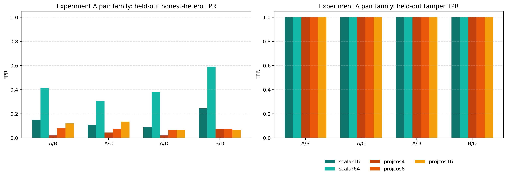

图说明：左半部分是 held-out honest-hetero FPR，右半部分是 held-out tamper TPR。它展示 projected-token 方法在 A/B、A/C、A/D、B/D 四个 hard/heterogeneous pair 上的 operating window。关键读法是：`projcos4` 在 B/D 上把 FPR 从 `scalar16` 的 `0.245` 降到 `0.075`，同时 TPR 保持 `1.000`，说明 projected-token sketch 对 hard pair 更稳。

### 主表

完整主表见 [`exp_e2_20260512_experiment_a_pair_family_projcos_paper_main_table.csv`](tables/exp_e2_20260512_experiment_a_pair_family_projcos_paper_main_table.csv)。

| Pair | Scalar16 FPR / TPR | ProjCos4 FPR / TPR | ProjCos8 FPR / TPR | ProjCos16 FPR / TPR |
|---|---:|---:|---:|---:|
| A/B | 0.150 / 1.000 | 0.020 / 1.000 | 0.080 / 1.000 | 0.120 / 1.000 |
| A/C | 0.110 / 1.000 | 0.045 / 1.000 | 0.075 / 1.000 | 0.135 / 1.000 |
| A/D | 0.090 / 1.000 | 0.020 / 1.000 | 0.065 / 1.000 | 0.065 / 1.000 |
| B/D | 0.245 / 1.000 | 0.075 / 1.000 | 0.075 / 1.000 | 0.065 / 1.000 |

### 结果解读

`B/D` 是 scalar-coordinate TSTC 的 hard pair。`projcos4` 将 B/D FPR 从 `0.245` 降到 `0.075`，同时 TPR 和 LocAcc 均为 `1.0`。这说明 projected-token TSTC 不是只在 A/B 有效，而是能改善 hard pair 的 verifiability profile。

论文中应写：projected-token TSTC opens a better operating window for hard heterogeneous pairs。不要写成所有 pair 都已被完全解决。

## 3. 实验 B：Equal-budget Baseline

### 手册要求对照

| 手册要求 | 当前完成情况 |
|---|---|
| Scalar-coordinate TSTC 16 | 已覆盖 `scalar16` |
| Scalar-coordinate TSTC 64 | 已覆盖 `scalar64` |
| Projected-scalar d=1 bridge | 已覆盖 `projscalar1_abs` |
| Projected-token d=4 cosine | 已覆盖 `projcos4` |
| Projected-token d=16 cosine | 已覆盖 `projcos16` |
| x-axis 为 bytes/checkpoint 或 scalars/checkpoint | 图中使用 bytes/checkpoint |
| 标出 FPR/TPR tradeoff | 已完成 |

### 主图

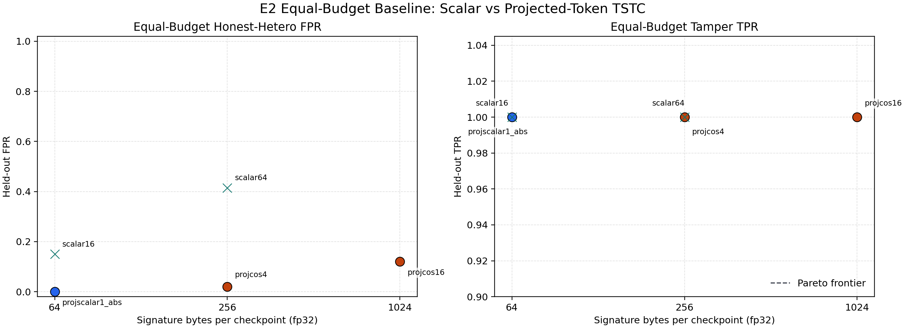

图说明：横轴是每个 checkpoint 的 signature payload bytes，纵轴分别展示 held-out FPR 与 tamper TPR。它回答“Projected-token 是否只是因为 sketch 更大”。关键对照是同为 `256B/checkpoint` 的 `scalar64` 与 `projcos4`：`scalar64` FPR 为 `0.415`，`projcos4` FPR 为 `0.020`，TPR 都是 `1.000`，所以收益不只是来自 payload 变大，而是来自 token-level geometry statistic。

### 主表

完整表见 [`exp_e2_20260512_equal_budget_live_ab_selected_summary.csv`](tables/exp_e2_20260512_equal_budget_live_ab_selected_summary.csv)。

| Variant | Bytes/ckpt | Eval FPR | Eval TPR | LocAcc | selected_from_feasible |
|---|---:|---:|---:|---:|---:|
| scalar16 | 64 | 0.150 | 1.000 | 1.000 | 0 |
| scalar64 | 256 | 0.415 | 1.000 | 1.000 | 0 |
| projscalar1_abs | 64 | 0.000 | 1.000 | 1.000 | 1 |
| projcos4 | 256 | 0.020 | 1.000 | 1.000 | 1 |
| projcos16 | 1024 | 0.120 | 1.000 | 1.000 | 1 |

### 数据说明

`projscalar1_abs` 是 `16 tokens x 1 scalar = 16 fp32 scalars = 64B/checkpoint`，不是 256B。手册早期表格里的 256B 应视为算术口径误差。真正等预算对照中，`scalar64` 与 `projcos4` 都是 256B/checkpoint；`scalar64` FPR 为 `0.415`，`projcos4` FPR 为 `0.020`。

### 结果解读

结果支持“ProjCos 的收益不是简单来自更大 sketch，而是来自 token-level geometry statistic”。在同为 256B/checkpoint 的情况下，`projcos4` 明显优于 `scalar64`。

### 补充：projscalar1_abs 多 seed / 全 pair 稳定性

为避免把 `projscalar1_abs` 的 A/B 单点好结果误判为 pair-specific 或 seed-specific 偶然性，已补做稳定性实验：

- 覆盖 `6` 个 strict pair：A/B、A/B-rtxint8、A/C、A/D、B/D、E/F。
- 覆盖 `5` 个 projection seed：`777 / 1001 / 2027 / 3407 / 9001`。
- 每个 pair/seed 都重新用 calibration split 选 operating point，再到 held-out eval 上报告。
- 产物见 [`exp_e2_20260512_projscalar1_abs_multiseed_stability_report.md`](notes/exp_e2_20260512_projscalar1_abs_multiseed_stability_report.md)。

先做的 A/B 与 B/D validation 如下：

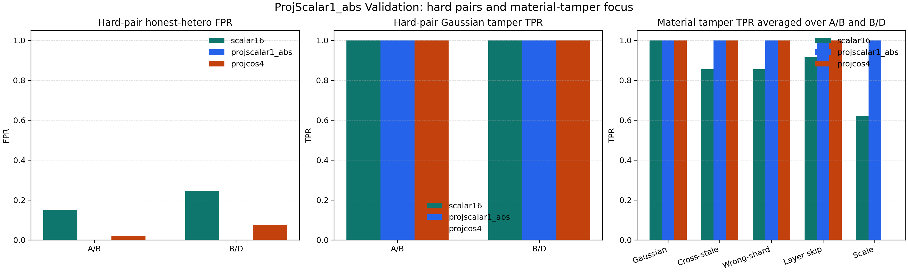

图说明：左侧比较 A/B、B/D 的 held-out FPR；中间比较 Gaussian tamper TPR；右侧比较 material focus attacks 的平均检测率。`projscalar1_abs` 在 A/B 与 B/D 上都是 `64B/checkpoint`，FPR 为 `0.000`，TPR 为 `1.000`；右侧也显示它对 semantic substitution、layer-skip、scale perturbation 都达到 `1.000`。这说明它不是只比 `scalar16` 多一点工程优化，而是保留了 token 向量的随机投影信息和幅值信息。

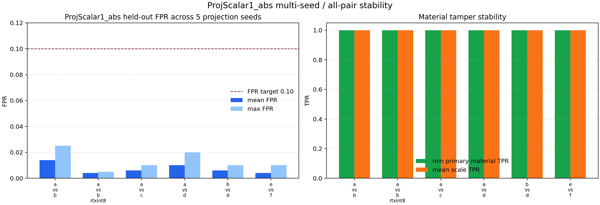

图说明：左侧给出 6 个 pair 在 5 个 projection seed 下的 mean/max held-out FPR，虚线是 `0.10` FPR 目标；右侧给出 primary material tamper 的最小 TPR 和 scale perturbation 的平均 TPR。所有 pair 的 max FPR 都不超过 `0.025`，所有 primary material TPR 和 scale TPR 都为 `1.000`。这基本排除了“只在 A/B 或单一 seed 上碰巧好”的解释。

总体结果：

| Runs | selected feasible rate | Mean eval FPR | Max eval FPR | Min eval TPR | Min primary material TPR | Min scale TPR |
|---:|---:|---:|---:|---:|---:|---:|
| 30 | 1.000 | 0.0073 | 0.025 | 1.000 | 1.000 | 1.000 |

这个结果说明 `projscalar1_abs` 不是只在 A/B 或单一随机种子上成立。它表现好的原因是：每个投影标量不是原始 sparse coordinate，而是整个 hidden vector 的随机线性混合，因此能捕获分散在很多 hidden 维度上的差异；同时它使用 absolute projected gap，保留 norm/scale 信息，所以能覆盖 `projcos4` 的 scale-only 盲点。

论文中建议的定位不是“替代 projcos4”，而是：`projscalar1_abs` 是一个很强的低预算 norm-sensitive bridge / hybrid candidate，可与 `projcos4` 组合成 `cosine + projection/norm gap` verifier。

进一步补充的实验 C extension 如下：

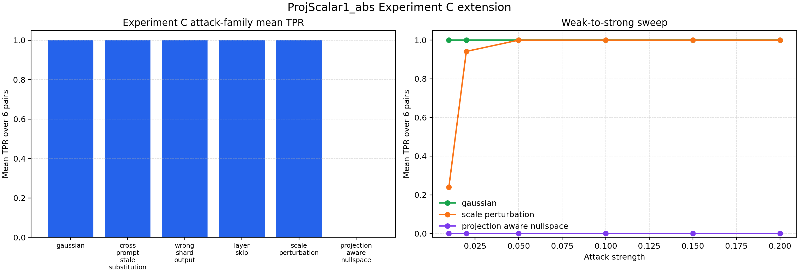

图说明：左侧是 6 个 strict pair 上的 attack-family 平均 TPR；右侧是 weak-to-strong strength sweep。`projscalar1_abs` 对 gaussian、cross-prompt stale、wrong-shard output、layer-skip、scale perturbation 在 strength=0.15 时均为 `1.000`；scale sweep 显示 strength=0.01 时平均 TPR 为 `0.239`，0.02 时升到 `0.942`，0.05 及以上为 `1.000`。同时，projection-aware null-space attack 在所有 strength 上 TPR 均为 `0.000`，明确展示 d=1 投影在 white-box/adaptive setting 下的可规避边界。

审计结论：补充实验结果自洽，未发现 calibration/evaluation 泄漏或从 held-out eval 反向挑选 seed 的问题。新增 projection-aware null-space attack 的投影矩阵与 verifier 使用的矩阵一致，因此 0 检出是有效边界结果。需要保留的科学边界是：null-space attack 证明 adaptive evasion 可能性，但当前没有额外证明该攻击一定 output-affecting；`projscalar1_abs` 仍未完整并入正式 E5 policy replay，因此当前应作为强补充证据和 hybrid candidate，而不是替换 E5 主线 profile。

## 4. 实验 C：Material Tamper Protocol 重写

实验 C 图表中的 `A/B`、`A/C`、`A/D`、`B/D`、`E/F` 都是匿名执行栈 pair label，不是算法变量。`E/F` 对应原始捕获目录 `t4strict_pair_e_vs_f_40_200`，含义是第 E 个执行栈与第 F 个执行栈之间的异构 pair 对照。

### 手册要求对照

| 手册要求 | 当前完成情况 |
|---|---|
| Wrong-shard output | 已覆盖 `wrong_shard_output` |
| Stale checkpoint replay | 已覆盖 `same_prompt_old_run_replay` 和 `cross_prompt_stale_substitution` |
| Layer skip / scale perturbation | 已覆盖 `layer_skip` 与 `scale_perturbation` |
| Output-affecting subset | 已完成 focus matrix next-token top-k 子实验 |
| Detection-vs-attack-strength 曲线 | 已完成 gaussian 与 scale_perturbation sweep；`projscalar1_abs` extension 另补 projection-aware null-space sweep |
| First mismatch localization | 已输出 detail 与 LocAcc |
| Statistical/material tamper 分层 | 已输出 `attack_layer` |

### 主图：Material Focus

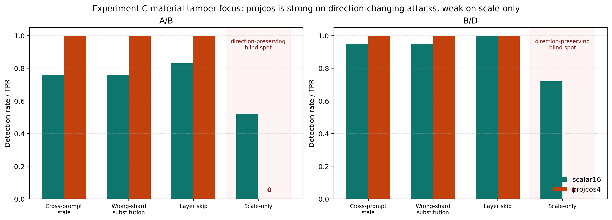

图说明：这张图聚焦 material tamper 的核心攻击族，比较 `scalar16` 与 `projcos4` 在不同 pair/attack 上的 TPR。读图重点是：`projcos4` 对 cross-prompt stale、wrong-shard output、layer-skip 这类方向改变/语义替换攻击接近满检出，但对 `scale_perturbation` 明确为 `0` 或接近 `0`。这不是漏画，而是 cosine-only sketch 的方向归一化边界。

### 主图：Strength Sweep

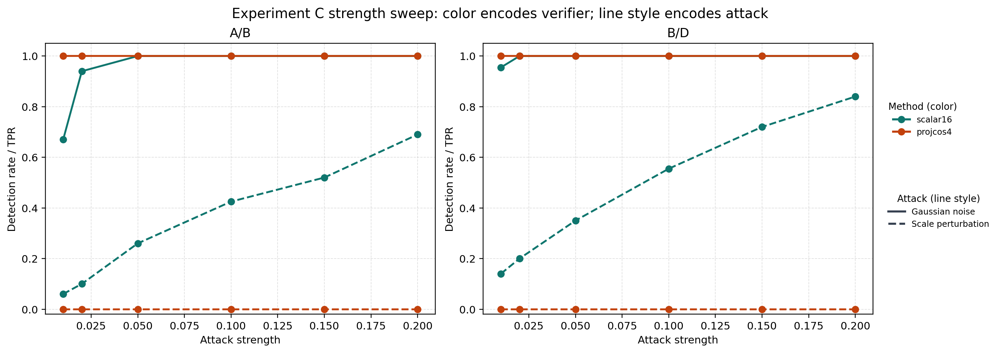

图说明：这张图展示 tamper strength 从 `0.01` 到 `0.20` 变化时的 detection curve。Gaussian 噪声强度上升时，`projcos4` 和 `scalar16` 都能保持高检测；scale perturbation 上，`projcos4` 因为只比较方向而持续失败，`scalar16` 会随 scale 变大逐步变好。它支撑的结论是：不同 tamper family 需要不同统计量，不能把 cosine-only verifier 写成通用 tamper detector。

### 主图：Focus TPR

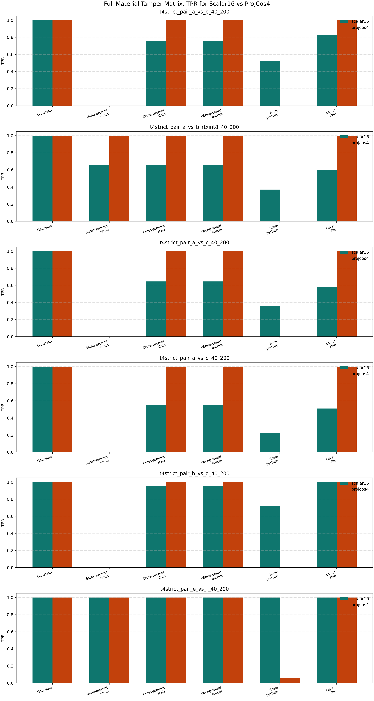

图说明：这张图把 full matrix 中最重要的 TPR 对照压缩到主文视角，重点显示 `gaussian / cross_prompt_stale_substitution / wrong_shard_output / layer_skip / scale_perturbation`。它和 Material Focus 图互相印证：方向改变类攻击上 `projcos4` 很强，scale-only 上失败。论文应把它写成 tamper-family differentiation，而不是单一胜负榜。

### 补充：projscalar1_abs 的实验 C 扩展

为验证 `projscalar1_abs` 是否在实验 C 的完整攻击家族上也稳定有效，已补做 6-pair focus matrix、weak-to-strong sweep，以及 projection-aware null-space attack。

产物见 [`exp_e2_20260512_projscalar1_abs_experiment_c_report.md`](notes/exp_e2_20260512_projscalar1_abs_experiment_c_report.md)。

结果摘要：

| Attack family | Mean TPR | Min TPR | Mean LocAcc |
|---|---:|---:|---:|
| gaussian | 1.000 | 1.000 | 1.000 |
| cross_prompt_stale_substitution | 1.000 | 1.000 | 1.000 |
| wrong_shard_output | 1.000 | 1.000 | 1.000 |
| layer_skip | 1.000 | 1.000 | 1.000 |
| scale_perturbation | 1.000 | 1.000 | 1.000 |
| projection_aware_nullspace | 0.000 | 0.000 | 0.000 |

弱攻击 sweep 的关键结果：

| Attack | strength=0.01 | strength=0.02 | strength=0.05+ |
|---|---:|---:|---:|
| gaussian | 1.000 | 1.000 | 1.000 |
| scale_perturbation | 0.239 | 0.942 | 1.000 |
| projection_aware_nullspace | 0.000 | 0.000 | 0.000 |

这说明 `projscalar1_abs` 对普通实验 C 攻击族非常强，尤其补上了 `projcos4` 在 scale-only 上的盲点。但 projection-aware null-space attack 也清楚暴露了 d=1 随机投影的白盒边界：如果攻击者知道 projection vector，可以让扰动近似落在投影核空间里，使 projected absolute gap 维持很小。因此论文中应把它定位为 `norm-sensitive hybrid component`，而不是单独的通用安全 verifier。

### Full Matrix 主表

完整表见 [`exp_e2_20260512_material_tamper_full_matrix_attack_summary.csv`](tables/exp_e2_20260512_material_tamper_full_matrix_attack_summary.csv)。

| Pair | Variant | Gaussian | Cross-prompt stale | Wrong-shard | Layer-skip | Scale perturbation |
|---|---|---:|---:|---:|---:|---:|
| A/B | scalar16 | 1.00 | 0.76 | 0.76 | 0.83 | 0.52 |
| A/B | projcos4 | 1.00 | 1.00 | 1.00 | 1.00 | 0.00 |
| B/D | scalar16 | 1.00 | 0.95 | 0.95 | 1.00 | 0.72 |
| B/D | projcos4 | 1.00 | 1.00 | 1.00 | 1.00 | 0.00 |

### Output-affecting Subset

完整 output-affecting 表见 [`exp_e2_20260512_output_affecting_subset_summary.csv`](tables/exp_e2_20260512_output_affecting_subset_summary.csv)。

这个子实验从 clean/attacked `C2` replay layers 16-23 到 next-token logits。若 `top1_changed == 1` 或 top-5 token set 发生变化，则标记为 output-affecting。它是 next-token top-k 级别，不是完整 generation 文本级别。

| Variant | Attack | Mean output-affecting TPR |
|---|---|---:|
| projcos4 | gaussian | 1.0000 |
| projcos4 | cross_prompt_stale_substitution | 1.0000 |
| projcos4 | wrong_shard_output | 1.0000 |
| projcos4 | layer_skip | 1.0000 |
| projcos4 | scale_perturbation | 0.0107 |
| scalar16 | gaussian | 1.0000 |
| scalar16 | cross_prompt_stale_substitution | 0.7573 |
| scalar16 | wrong_shard_output | 0.7573 |
| scalar16 | layer_skip | 0.7542 |
| scalar16 | scale_perturbation | 0.5516 |

### 结果解读

实验 C 应被解释为 tamper-family differentiation study。`projcos4` 对 direction-changing 或 semantic-substitution attacks 很强，包括 cross-prompt stale、wrong-shard 和 layer-skip；但对 direction-preserving `scale_perturbation` 失败。这不是代码 bug，而是 cosine-only sketch 的数学边界：cosine 主要比较方向，天然弱化 norm change。

论文中建议写：

- 可以写：Projected-token TSTC strongly detects direction-changing material tamper.
- 必须写：Scale-only attacks require norm-sensitive or hybrid sketch.
- 不要写：ProjCos universally dominates all material tamper.

## 5. 实验 D：Projected-token TSTC Overhead

### 手册要求对照

| 手册要求 | 当前完成情况 |
|---|---|
| Bytes/checkpoint | 已输出 |
| Bytes/trace for 3 checkpoints | 已输出 |
| Commitment size | 已输出 |
| Sketch/replay/compare runtime | 已输出 detail/summary |
| Challenge latency | 已输出 |
| Network reveal payload | 已用 reveal payload 表示 |

### 主图

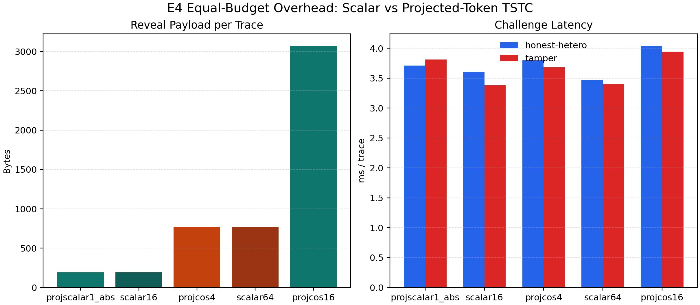

图说明：这张图同时展示 payload 和 challenge-time latency。`scalar16` 与 `projscalar1_abs` 都是 `64B/checkpoint`、`192B/trace`；`projcos4` 是 `256B/checkpoint`、`768B/trace`；`projcos16` 是 `1024B/checkpoint`、`3072B/trace`。latency 都在几毫秒级，说明 projected-token sketch 不是免费，但作为 challenge-time verifier 是 bounded/compact 的。

### 主表

完整表见 [`exp_e4_20260512_equal_budget_live_ab_main_table.csv`](tables/exp_e4_20260512_equal_budget_live_ab_main_table.csv)。

| Variant | Bytes/ckpt | Bytes/trace | Honest-hetero latency ms | Tamper latency ms |
|---|---:|---:|---:|---:|
| scalar16 | 64 | 192 | 3.603487 | 3.381667 |
| scalar64 | 256 | 768 | 3.468791 | 3.402573 |
| projscalar1_abs | 64 | 192 | 3.708742 | 3.813726 |
| projcos4 | 256 | 768 | 3.798230 | 3.683724 |
| projcos16 | 1024 | 3072 | 4.040801 | 3.943448 |

### 结果解读

Projected-token TSTC 的开销确实高于 scalar16，但仍是小 sketch：`projcos4` 为 768B/trace，`projcos16` 为 3072B/trace。挑战路径 latency 仍为几毫秒级。论文中应写 “bounded enough for challenge-time or high-risk-pair verification”，不要写 “nearly free”。

边界：这张 overhead 表基于 A/B live equal-budget setting；E5 使用它作为 measured profile 的 overhead input，不代表所有 pair 的 overhead 都逐一在线实测。

## 6. 实验 E：Placement 使用 Measured Profile

### 手册要求对照

| 手册要求 | 当前完成情况 |
|---|---|
| pair risk class | 已在 verification profile matrix 输出 |
| expected challenge workload | 已在 policy compare 输出 |
| expected false dispute cost/risk | 已输出 false dispute risk |
| sketch budget requirement | 已输出 bytes/checkpoint 和 bytes/trace |
| random policy | 已覆盖 |
| cost-only policy | 已覆盖 |
| network-aware policy | 已覆盖 |
| reputation-aware policy | 已覆盖 |
| verification-aware / risk-constrained | 已覆盖 |
| adaptive-verifier placement | 已覆盖原型；当前 candidate set 主要体现 scalar16 到 projcos4 |
| latency/goodput/challenge/workload/risk/risk-adjusted goodput | 已覆盖 |
| Pareto frontier | 已输出 |
| bar/risk stack | 已输出 |
| policy metrics table | 已输出 |

### Profile Matrix

完整表见 [`exp_e5_20260512_verification_profile_matrix.csv`](tables/exp_e5_20260512_verification_profile_matrix.csv)。

| Risk class | Count |
|---|---:|
| low-risk | 15 |
| medium-risk | 4 |
| high-risk | 5 |
| unverifiable | 6 |

Feasible rows under `alpha=0.10, beta=0.90`：`15/30`。

### E5 图：Queued Workload

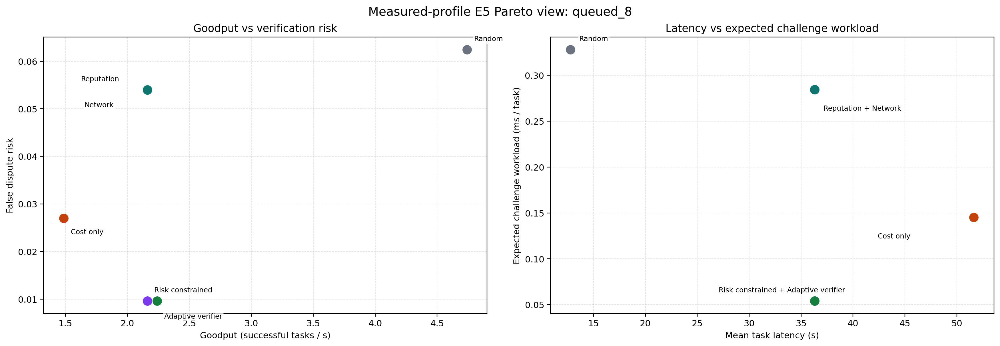

图说明：左图是 goodput 与 false dispute risk 的 Pareto 视角，右图是 latency 与 expected challenge workload。`risk_constrained` 与 `network_aware` 在 queued workload 下 goodput 相同，但 `risk_constrained` 的 expected challenge workload 从 `0.284592` 降到 `0.054005`，false dispute risk 从 `0.054000` 降到 `0.009600`。这张图支撑“verification-aware 不是追求最低 latency，而是在相近 SLO 下降低验证风险”。

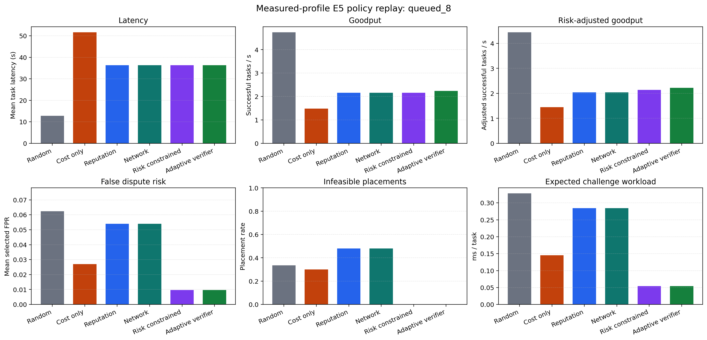

图说明：这张柱状图把 queued workload 下每个 policy 的 latency、goodput、risk-adjusted goodput、false dispute risk、infeasible placements 和 expected challenge workload 放在一起。它显示 `random` 虽然 goodput 最高，但风险和 infeasible usage 更高；`risk_constrained` 与 `adaptive_verifier` 把 infeasible rate 压到 `0`，同时显著降低 expected challenge workload。

图说明：这张堆叠图展示每个 policy 使用 low/medium/high/unverifiable placement 的比例。`risk_constrained` 和 `adaptive_verifier` 避免了 unverifiable placements；`reputation_aware` 与 `network_aware` 仍会使用较多 infeasible/high-risk 组合。这直接对应手册 7.6 的 unverifiable pair usage rate 要求。

### E5 图：Single-task Workload

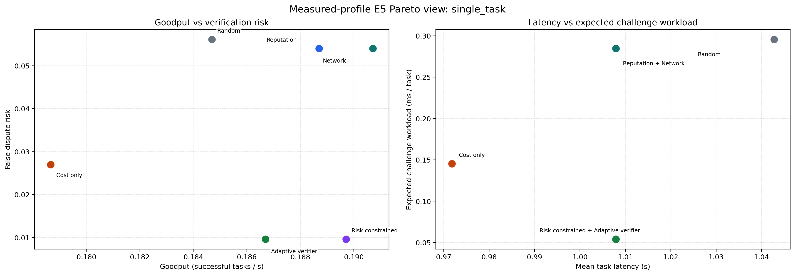

图说明：Single-task workload 下，policy 的 latency 差异较小，因此重点看 false dispute risk 和 expected challenge workload。`risk_constrained` 在接近的 latency/goodput 下把 false dispute risk 降到 `0.009600`，expected challenge workload 降到 `0.054005`，说明 placement 风险控制不是 queued workload 的偶然现象。

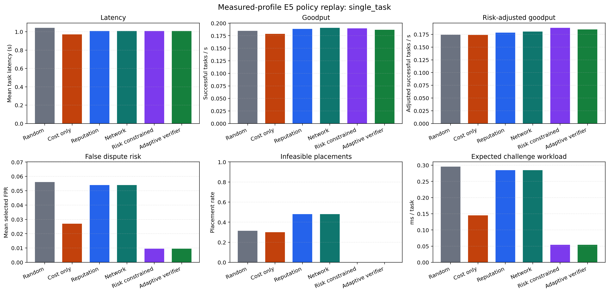

图说明：这张图把 single-task workload 的六个指标展开。`cost_only` latency 最低但仍有 `0.300` infeasible rate；`risk_constrained` latency 略高，却把 infeasible rate 降到 `0`，并给出最高或接近最高的 risk-adjusted goodput。它支撑“不要把 E5 目标写成 latency 最低”的论文表述。

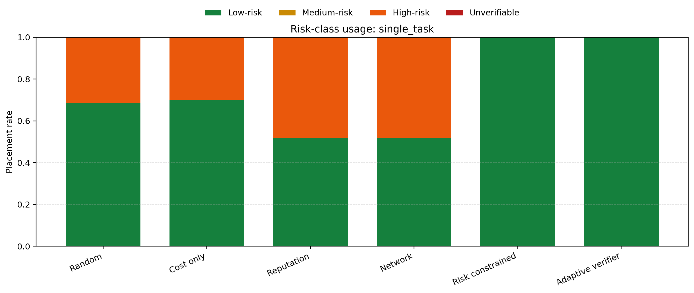

图说明：这张图显示 single-task 下不同 policy 的 placement risk composition。`risk_constrained` 与 `adaptive_verifier` 主要使用 feasible low-risk choices；`random/cost_only/reputation/network` 仍混入 high-risk 或 unverifiable choices。它说明 risk-aware placement 是对 pair/signature 可验证性的结构性约束，而不是事后报警。

### Policy Compare 主表

完整表见 [`exp_e5_20260512_measured_profile_mainline_policy_compare.csv`](tables/exp_e5_20260512_measured_profile_mainline_policy_compare.csv)。

| Workload | Policy | Latency s | Goodput | Expected challenge workload ms/task | False dispute risk | Infeasible rate | Risk-adjusted goodput |
|---|---|---:|---:|---:|---:|---:|---:|
| single_task | random | 1.042742 | 0.184689 | 0.295493 | 0.056100 | 0.315 | 0.174328 |
| single_task | cost_only | 0.971796 | 0.178667 | 0.145264 | 0.027000 | 0.300 | 0.173843 |
| single_task | reputation_aware | 1.007899 | 0.188704 | 0.284592 | 0.054000 | 0.480 | 0.178514 |
| single_task | network_aware | 1.007899 | 0.190712 | 0.284592 | 0.054000 | 0.480 | 0.180413 |
| single_task | risk_constrained | 1.007899 | 0.189708 | 0.054005 | 0.009600 | 0.000 | 0.187887 |
| single_task | adaptive_verifier | 1.007899 | 0.186697 | 0.054005 | 0.009600 | 0.000 | 0.184905 |
| queued_8 | random | 12.781498 | 4.741068 | 0.327945 | 0.062425 | 0.335 | 4.445107 |
| queued_8 | cost_only | 51.636917 | 1.485707 | 0.145264 | 0.027000 | 0.300 | 1.445593 |
| queued_8 | reputation_aware | 36.310436 | 2.160597 | 0.284592 | 0.054000 | 0.480 | 2.043924 |
| queued_8 | network_aware | 36.310436 | 2.160597 | 0.284592 | 0.054000 | 0.480 | 2.043924 |
| queued_8 | risk_constrained | 36.310436 | 2.160597 | 0.054005 | 0.009600 | 0.000 | 2.139855 |
| queued_8 | adaptive_verifier | 36.310436 | 2.240619 | 0.054005 | 0.009600 | 0.000 | 2.219109 |

### 结果解读

E5 的正确结论不是 “verification-aware placement latency 最低”。它的目标是 under similar latency/goodput SLO，降低 verification risk。

在 `queued_8` workload 中，`network_aware` 与 `risk_constrained` goodput 都为 `2.160597`，但 `risk_constrained` 将 infeasible rate 从 `0.480` 降到 `0.000`，将 expected challenge workload 从 `0.284592` 降到 `0.054005`，将 false dispute risk 从 `0.054000` 降到 `0.009600`。这正好支撑手册 7.6 的论文主张。

边界：E5 是 measured-profile policy replay under a modeled placement workload，不是 live online scheduler deployment。Adaptive verifier 当前是原型路径，主要体现为在候选集中从 scalar16 升级到 projcos4；不是完整多级在线 verifier scheduler。

## 7. 论文中可直接使用的主张

| 主张 | 支撑实验 | 建议写法 |
|---|---|---|
| Scalar-coordinate TSTC cheap but weak | A/B/C/D | Sparse scalar sketches expose a false-positive/detection tradeoff under heterogeneity. |
| Projected-token TSTC improves operating window | A/B | Projected-token sketches retain token-level geometry and improve the FPR/TPR tradeoff. |
| Projected-token TSTC detects direction-changing tamper | C | ProjCos is strong on semantic substitution and layer-skip material tamper. |
| Scale-only attacks are a limitation for cosine-only sketch | C/C-output | Cosine-only sketches are weak against direction-preserving scale perturbations. |
| Norm-sensitive projection gap complements cosine | B/C-extension/D | `projscalar1_abs` detects ordinary scale/material tamper at 64B/checkpoint but fails projection-aware null-space attacks, motivating hybrid verification. |
| Projected-token overhead is bounded | D | Projected-token sketches increase payload but remain compact for challenge-time verification. |
| Verifiability should guide placement | E | Verification-aware placement reduces infeasible/high-risk placements and challenge workload under similar SLO. |

## 8. 不应写的过强表述

| 不应写 | 原因 |
|---|---|
| TSTC solves heterogeneous verification | 当前结果支持 profile/constraint，不支持 universal verifier |
| ProjCos universally dominates all tamper | `scale_perturbation` 明确失败 |
| projscalar1_abs is adaptively secure by itself | projection-aware null-space attack 明确 0 检出 |
| Output-affecting subset covers full generation | 当前是 next-token top-k |
| Experiment C is online adversarial deployment | 当前是 offline replay on real captures |
| E5 is live scheduler deployment | 当前是 measured-profile policy replay |
| Projected-token overhead is nearly free | 它比 scalar 更大，应写 bounded/compact |

## 9. 最终交付判断

本文件夹已经包含手册实验部分要求的全部主结果：图、表、CSV 数据、报告和关键脚本。A/B/C/D/E 实验可以作为 DDL 冲刺版论文 Evaluation 的交付基础。

最稳妥的论文主线是：

> VeriEdge treats low-cost verifiability as a placement constraint. TSTC is a tolerance-aware checkpoint-sketch chain family. Sparse scalar TSTC is a cheap baseline that exposes the difficulty of heterogeneous verification, while projected-token TSTC preserves token-level geometry and improves the practical operating window for direction-changing material tamper. A norm-sensitive random-projection gap sketch such as `projscalar1_abs` complements cosine sketches by detecting ordinary scale perturbations at low payload, while projection-aware null-space attacks motivate hybrid rather than single-statistic verification. The resulting measured risk/cost profile lets the orchestrator avoid or upgrade high-risk pair/signature choices.
