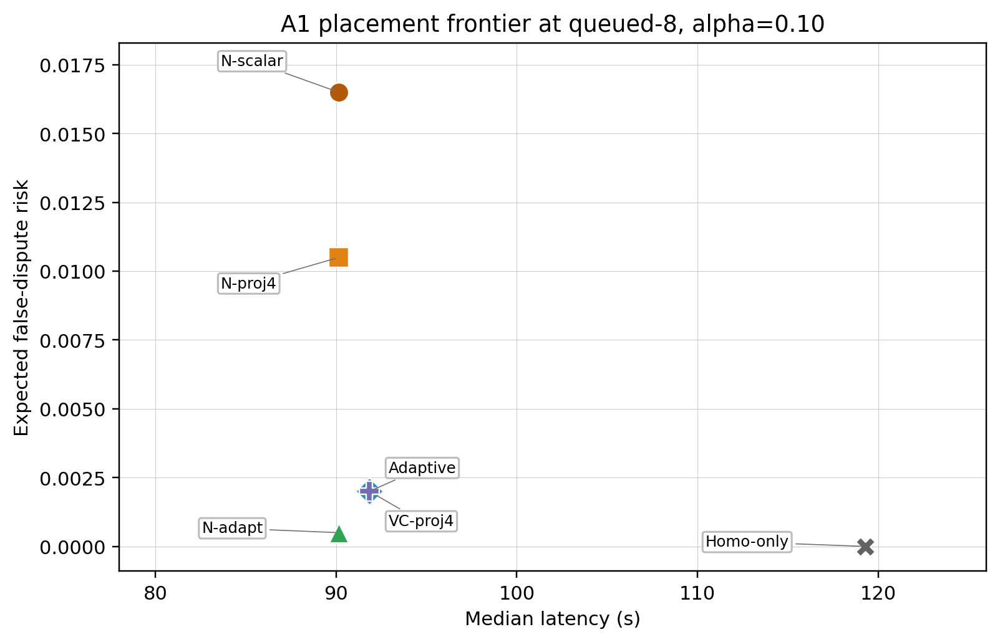
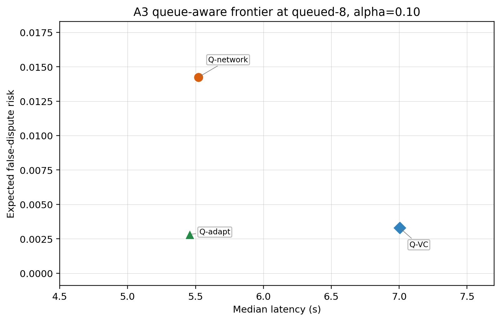
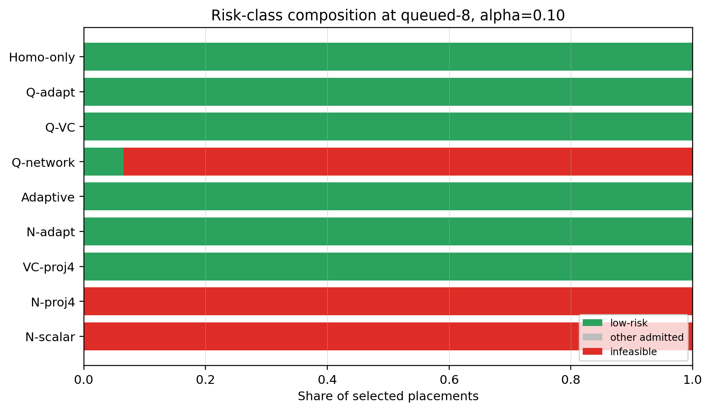
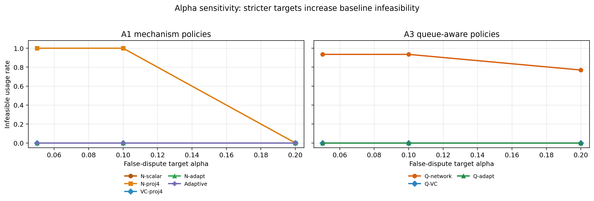

# 实验 A：A1 Controlled Replay 与 A3 Queue-Aware Replay 结果记录与解读

## 1. 对照 workbook 的实验目标

`veriedge_revision_workbook.md` 对实验 A 的目标定义是：

> measured verifier profile 可以作为 placement 的硬约束，改变 heterogeneous edge LLM inference 的 placement frontier。

本交付包严格围绕 workbook 的 Experiment A 要求组织，只包含：

- A1 Controlled replay：closed-loop verifiability-constrained placement replay 主实验。
- A3 Queue-aware replay：在 queued workload 下加入 busy queue scoring 的补充消融。


## 2. 交付包目录

本交付包位于：

`VeriEdge/paper1_veriedge/veriedge_revision_results/实验A交付物`

目录结构：

```text
实验A交付物/
  data/
    profile_matrix.csv
    candidate_placements.csv
    workload.csv
  results/
    placement_runs.csv
    placement_summary.csv
    placement_summary_by_seed.csv
  figures/
    fig_placement_frontier_a1.png / .pdf
    fig_placement_frontier_a3_queue.png / .pdf
    fig_risk_class_composition.png / .pdf
    fig_alpha_sensitivity_infeasible.png / .pdf
  scripts/
    run_experiment_a_full.py
  docs/
    veriedge_revision_workbook.md
    实验A_A1_A3结果记录与解读.md
  metadata/
    environment.md
    git_commit.txt
    network_config.md
  paper_snippets/
    abstract_numbers.txt
    figure_captions.txt
    placement_eval_subsection.tex
```

## 3. 输入数据

### 3.1 `data/profile_matrix.csv`

记录 measured verifier profiles。每一行对应一个 `pair_id + sketch` signature，包含：

- FPR：honest heterogeneous false-positive / false-dispute rate。
- TPR：material tamper true-positive rate。
- bytes trace：challenge trace reveal 数据量。
- verify latency：challenge-time verifier latency。
- risk class：low / medium / high / infeasible。

这些 profile 来自 20260512 的 measured verifier profile matrix，不是在实验 A 中现场合成。

### 3.2 `data/candidate_placements.csv`

记录 replay 中可选的 candidate placements，包括：

- group size
- provider set
- shard map
- pair ids
- network / execution latency
- availability cost
- reputation
- backend mix

Controlled replay 中 heterogeneous candidates 均按 `group_size=3` 组织；`E/F` 是 pair/profile label，不表示只用两台机器执行。

### 3.3 `data/workload.csv`

包含 `single` 与 `queued-8` 两类 workload。本报告重点解读 `queued-8, alpha=0.10, beta=0.90`，因为 workbook 要求 queued workload 并建议用该点作为主结果。

## 4. Feasibility 定义

candidate 被认为可裁决，需要满足：

```text
capacity_ok == 1
group_size <= max_group_size
FPR(candidate, selected_sketch) <= alpha
TPR(candidate, selected_sketch) >= beta
bytes_trace(candidate, selected_sketch) <= sketch_budget_bytes
verify_ms(candidate, selected_sketch) <= verify_budget_ms
```

本实验主设置：

| 参数 | 数值 | 含义 |
|---|---:|---|
| `alpha` | 0.10 | honest execution 被误判为异常的上限 |
| `beta` | 0.90 | material tamper 检出率下限 |
| `sketch_budget_bytes` | 3072 | challenge trace reveal 数据量预算 |
| `verify_budget_ms` | 5.0 | verifier challenge latency 预算 |
| `challenge_prob` | 0.10 | false risk / challenge workload 计算中的 challenge 概率 |

## 5. Policy 分组

### 5.1 A1 Controlled Replay Policies

| Policy | 定义 | 作用 |
|---|---|---|
| `network_aware_scalar` | 按 latency/network 选 group，固定 `scalar16` | 原始弱 baseline |
| `network_aware_projcos4` | 按 latency/network 选 group，固定 `projcos4` | 公平 fixed-sketch baseline |
| `verif_constrained_projcos4` | 固定 `projcos4`，先过滤不满足约束的 candidate | 主 hard-filter policy |
| `network_aware_adaptive` | 先按 latency 选 group，再为该 group 选最小可行 sketch | 验证 sketch upgrade |
| `adaptive_verifier` | 同时选择 group 和最小可行 sketch | 验证 joint group/sketch selection |
| `homogeneous_only` | 只允许 homogeneous candidate | 保守对照 |

### 5.2 A3 Queue-Aware Policies

queue-aware policies 在 score 中加入当前 candidate 的排队等待：

```text
score(candidate) =
  estimated_latency(candidate, task)
  + max(0, busy_until[candidate] - arrival_s)
  + verifier/risk/sketch penalty
```

| Policy | 定义 | 作用 |
|---|---|---|
| `queue_aware_network` | queue-aware score，固定 `scalar16`，不做 verifier hard filtering | 检查 queue-aware load balancing 本身是否足够 |
| `queue_aware_verif_constrained` | queue-aware score + 固定 `projcos4` hard filtering | 检查 queue-aware + verifier constraint |
| `queue_aware_adaptive` | queue-aware score + 最小可行 sketch selection | 检查 queue-aware + adaptive verifier |

## 6. 主结果表

`queued-8, alpha=0.10, beta=0.90`：

| Policy | Median latency | P95 latency | Goodput | Challenge ms/task | False risk | Infeasible | Low-risk | Admission |
|---|---:|---:|---:|---:|---:|---:|---:|---:|
| `network_aware_scalar` | 90.156 | 170.384 | 1.079 | 0.360 | 0.0165 | 1.000 | 0.000 | 1.000 |
| `network_aware_projcos4` | 90.156 | 170.384 | 1.079 | 0.380 | 0.0105 | 1.000 | 0.000 | 1.000 |
| `verif_constrained_projcos4` | 91.844 | 173.576 | 1.060 | 0.380 | 0.0020 | 0.000 | 1.000 | 1.000 |
| `network_aware_adaptive` | 90.156 | 170.384 | 1.079 | 0.392 | 0.0005 | 0.000 | 1.000 | 1.000 |
| `adaptive_verifier` | 91.844 | 173.576 | 1.060 | 0.380 | 0.0020 | 0.000 | 1.000 | 1.000 |
| `queue_aware_network` | 5.522 | 9.757 | 12.266 | 0.360 | 0.0142 | 0.935 | 0.065 | 1.000 |
| `queue_aware_verif_constrained` | 7.004 | 12.714 | 10.392 | 0.380 | 0.0033 | 0.000 | 1.000 | 1.000 |
| `queue_aware_adaptive` | 5.457 | 9.781 | 12.251 | 0.380 | 0.0028 | 0.000 | 1.000 | 1.000 |
| `homogeneous_only` | 119.301 | 225.498 | 0.822 | 0.360 | 0.0000 | 0.000 | 1.000 | 1.000 |

## 7. A1 结果解读

### 7.1 `network_aware_scalar`

`network_aware_scalar` 只按 latency/network 选 group，并固定使用 `scalar16` verifier。结果：

- goodput = `1.079`
- false risk = `0.0165`
- infeasible rate = `1.000`

这支持 workbook 的 H1：低延迟 placement 会选中不可裁决的 heterogeneous signature。

### 7.2 `network_aware_projcos4`

`network_aware_projcos4` 是公平 fixed-sketch baseline。它已经把 verifier 从 `scalar16` 换成 `projcos4`，但仍然只按 latency/network 选 group，不做 hard filtering。

结果仍然：

- infeasible rate = `1.000`
- false risk = `0.0105`

这说明问题不只是 `scalar16` 太弱，而是 placement policy 没有用 verifier profile 过滤不可行 candidate。单纯换 verifier sketch，不等于 closed-loop placement。

### 7.3 `verif_constrained_projcos4`

`verif_constrained_projcos4` 使用同一个 fixed sketch `projcos4`，但会在 placement 前过滤违反 `alpha/beta/B/C` 的 candidate。

结果：

- infeasible rate 从 `1.000` 降到 `0.000`
- false risk 从 `0.0105` 降到 `0.0020`
- goodput 从 `1.079` 小幅降到 `1.060`

这支持 workbook 的 H2：verifiability-constrained placement 可以过滤 risky signatures，使 infeasible usage 接近 0。

### 7.4 `network_aware_adaptive` 与 `adaptive_verifier`

`network_aware_adaptive` 保留 latency-preferred group，但升级 sketch：

- infeasible rate = `0.000`
- false risk = `0.0005`
- goodput = `1.079`

`adaptive_verifier` 同时考虑 group 和 sketch，当前选择更低 sketch cost 的 feasible combination：

- infeasible rate = `0.000`
- false risk = `0.0020`
- goodput = `1.060`

这支持 workbook 的 H4：adaptive-verifier policy 可以通过升级 sketch 或改变 group/sketch 组合来满足 `alpha/beta` target。

### 7.5 对 H3 的解读

H3 要求观察 queued workload 下 goodput 是否显著受损。

在 non-queue-aware A1 主机制实验中：

- `network_aware_projcos4` goodput = `1.079`
- `verif_constrained_projcos4` goodput = `1.060`

下降约 `1.8%`，属于小幅 tradeoff。因此可以写成：

> hard filtering removes infeasible placements with only a modest goodput change in this replay.

但不能把它写成 live scheduler 结论，因为这是 offline replay。

## 8. A3 Queue-Aware 结果解读

A3 的目的不是替代 A1，而是补强 workbook 对 queued workload / goodput 的要求。它回答：

> 如果 policy 选择 placement 时已经考虑 busy queue，verifier constraints 是否仍然必要？

结果显示：

### 8.1 Queue-aware 明显改善 queued workload

`queue_aware_network` 相比 `network_aware_scalar`：

- median latency 从 `90.156` 降到 `5.522`
- p95 latency 从 `170.384` 降到 `9.757`
- goodput 从 `1.079` 提升到 `12.266`

这说明把 `busy_until` 纳入 score 后，policy 不再把所有任务压到同一个最快 candidate，而是能分散负载。

### 8.2 Queue-aware 不能替代 verifier constraints

`queue_aware_network` 虽然 goodput 高，但：

- infeasible rate = `0.935`
- low-risk share = `0.065`

也就是说，queue-aware load balancing 只解决拥塞，不解决 verifier infeasibility。

### 8.3 Queue-aware + verifier constraints 才是正确组合

`queue_aware_verif_constrained`：

- goodput = `10.392`
- infeasible rate = `0.000`
- false risk = `0.0033`

`queue_aware_adaptive`：

- goodput = `12.251`
- infeasible rate = `0.000`
- false risk = `0.0028`

这说明即使调度器已经 queue-aware，仍然需要 verifier profile 作为 placement-time admission / sketch-selection constraint。

## 9. 图表说明

### Figure A1a：A1 Placement Frontier

文件：

- `fig_placement_frontier_a1.png`
- `figures/fig_placement_frontier_a1.pdf`



含义：只展示 A1 controlled replay 的 placement/verifier frontier，横轴是 median latency，纵轴是 false risk。把 A1 单独成图后，重点更清楚：latency-oriented baseline 倾向选择更快但 infeasible 的 signature；verifiability-constrained / adaptive policies 用 verifier profile 在 placement 前筛掉或升级不可行 signature，把结果推向 feasible / low-risk 区域。

### Figure A1b：A3 Queue-Aware Frontier

文件：

- `fig_placement_frontier_a3_queue.png`
- `figures/fig_placement_frontier_a3_queue.pdf`



含义：只展示 A3 queue-aware policies。这里加入了 current queue wait 后，median latency 和 goodput 明显改善；但 `queue_aware_network` 仍会选择 infeasible signatures，说明 queue-aware scoring 解决的是排队等待问题，不能替代 verifiability constraint。

### Figure A2：Risk-Class Composition

文件：

- `figures/fig_risk_class_composition.png`
- `figures/fig_risk_class_composition.pdf`



含义：展示各 policy 选中 placements 的 low-risk / infeasible 比例。`network_aware_*` 和 `queue_aware_network` 仍有 infeasible slice；`verif_constrained` / `adaptive` policies 将 infeasible 降到 0。

纵坐标缩写含义：

| 缩写 | 完整 policy | 含义 |
|---|---|---|
| `N-scalar` | `network_aware_scalar` | 只按 network/latency 选 group，固定 scalar16 |
| `N-proj4` | `network_aware_projcos4` | 只按 network/latency 选 group，固定 projcos4 |
| `VC-proj4` | `verif_constrained_projcos4` | 固定 projcos4，并过滤不可行 candidate |
| `N-adapt` | `network_aware_adaptive` | 先按 network/latency 选 group，再升级到最小可行 sketch |
| `Adaptive` | `adaptive_verifier` | group 与 sketch 联合选择 |
| `Q-network` | `queue_aware_network` | queue-aware score，固定 scalar16，不做 verifier hard filtering |
| `Q-VC` | `queue_aware_verif_constrained` | queue-aware score + projcos4 hard filtering |
| `Q-adapt` | `queue_aware_adaptive` | queue-aware score + adaptive verifier |
| `Homo-only` | `homogeneous_only` | 只允许 homogeneous candidate |

### Figure A3：Alpha Sensitivity

文件：

- `figures/fig_alpha_sensitivity_infeasible.png`
- `figures/fig_alpha_sensitivity_infeasible.pdf`



含义：展示 `alpha = 0.05 / 0.10 / 0.20` 下 infeasible rate 的变化，证明结论不是只依赖单点 `alpha=0.10`。新版图只保留 workbook 主线相关 policy，并分成 A1 机制组与 A3 queue-aware 组两个面板；由于多条线在 0 或 1 处重合，图中改用面板下方图例而不是线尾标签，避免标签堆叠。读图重点是：

- `network_aware_scalar` / `network_aware_projcos4` 在严格 alpha 下保持高 infeasible。
- `verif_constrained_projcos4` / `adaptive_verifier` 在 sweep 中保持 infeasible 为 0。
- `queue_aware_network` 即使考虑 busy queue，仍有较高 infeasible；`queue_aware_verif_constrained` / `queue_aware_adaptive` 仍保持 infeasible 为 0。

## 10. 对 workbook 假设的回答

| Workbook 假设 | 是否支持 | 证据 |
|---|---|---|
| H1. Network-aware / cost-only 会选择低 latency 但不可裁决的 heterogeneous pairs | 支持 | `network_aware_projcos4` infeasible rate = `1.000` |
| H2. Verifiability-constrained placement 会过滤这些 pairs，使 infeasible usage 接近 0 | 支持 | `verif_constrained_projcos4` infeasible rate = `0.000` |
| H3. queued workload 下过滤 risky signatures 不一定显著损失 goodput | 支持但需谨慎 | A1 goodput 从 `1.079` 到 `1.060`；A3 queue-aware constrained goodput = `10.392` |
| H4. Adaptive-verifier policy 可以升级 sketch mode 保留更多 candidate | 支持 | `network_aware_adaptive` infeasible = `0.000` 且 goodput = `1.079`；`queue_aware_adaptive` goodput = `12.251` |

## 11. 可写进论文的结论

可以写：

- Closed-loop placement replay shows that measured verifier profiles can be used before disclosure as admission constraints.
- Under `queued-8, alpha=0.10`, fixed `projcos4` network-aware placement still selects infeasible signatures, while `verif_constrained_projcos4` reduces infeasible usage from `1.000` to `0.000`.
- Adaptive verifier selection can satisfy the target by upgrading sketch or choosing another feasible group/sketch combination.
- Queue-aware placement improves queued replay latency/goodput, but queue-awareness alone does not remove verifier infeasibility; queue-aware verifier-constrained/adaptive policies reduce infeasible usage to `0.000`.

需要谨慎写：

- 这是 offline replay，不是 live scheduler deployment。
- controlled replay 的 candidate latency 是受控构造，用来演示 workbook 要求的 closed-loop mechanism。
- Goodput 可以作为 replay 指标，但不能夸大成真实系统吞吐。

不能写：

- 不能说所有真实 workload 下 hard filtering 都无代价。
- 不能说 verifier profile 证明了语义正确性；它证明的是在论文定义的 checkpoint/profile 范围内可裁决。
- 不能把 A2/A4 robustness/stress 结论混进本交付包的主实验结论。

## 12. 推荐论文段落

```text
Closed-loop placement changes which heterogeneous executions are admitted before task disclosure. Under the queued-8 workload with alpha=0.10 and beta=0.90, network-aware placement with a fixed projcos4 verifier selects infeasible signatures for all admitted tasks. Verifiability-constrained placement uses the same measured verifier profile before disclosure and reduces infeasible usage from 1.000 to 0.000, while reducing expected false-dispute risk from 0.0105 to 0.0020 with only a modest replay goodput change. Adaptive verifier selection also reaches zero infeasible usage by upgrading or selecting feasible group/sketch combinations.

To account for queued workload effects, we additionally evaluate queue-aware policies that include current candidate wait time in the placement score. Queue-aware scoring improves replay goodput, but queue-aware network placement remains infeasible for 93.5% of admitted tasks. Combining queue-aware scoring with verifiability constraints or adaptive verifier selection reduces infeasible usage to zero. These results show that measured verifier behavior is useful before execution: it turns heterogeneous verifiability into a placement-time admission and verifier-selection constraint rather than an after-the-fact checker.
```

## 13. 最终判断

按照 workbook 要求，当前 A1 + A3 已经可以作为实验 A 的正式交付：

- 输入文件齐全。
- policy ablation 齐全。
- queued workload 齐全。
- alpha sweep 齐全。
- placement frontier / risk composition / alpha sensitivity 图齐全。
- `placement_runs.csv` 与 `placement_summary.csv` 齐全。
- 结果能够回答 H1-H4。
