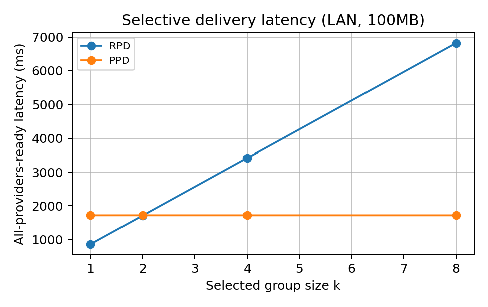
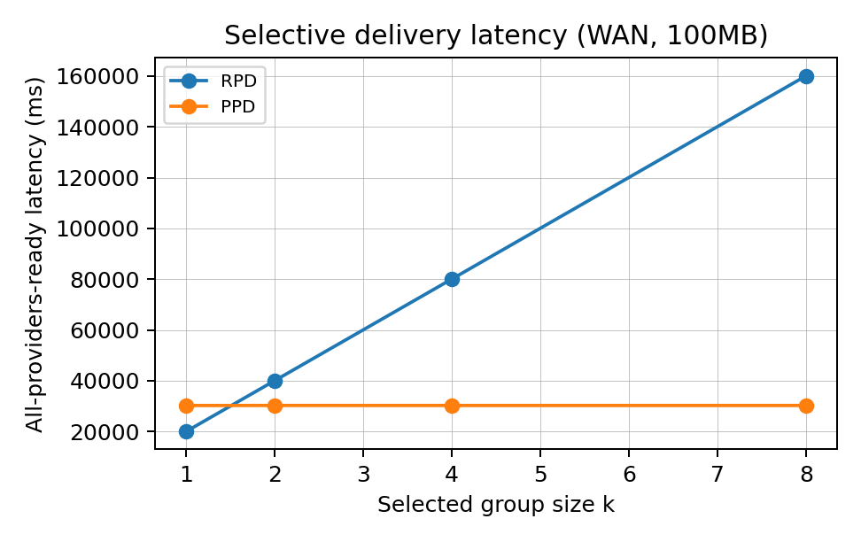
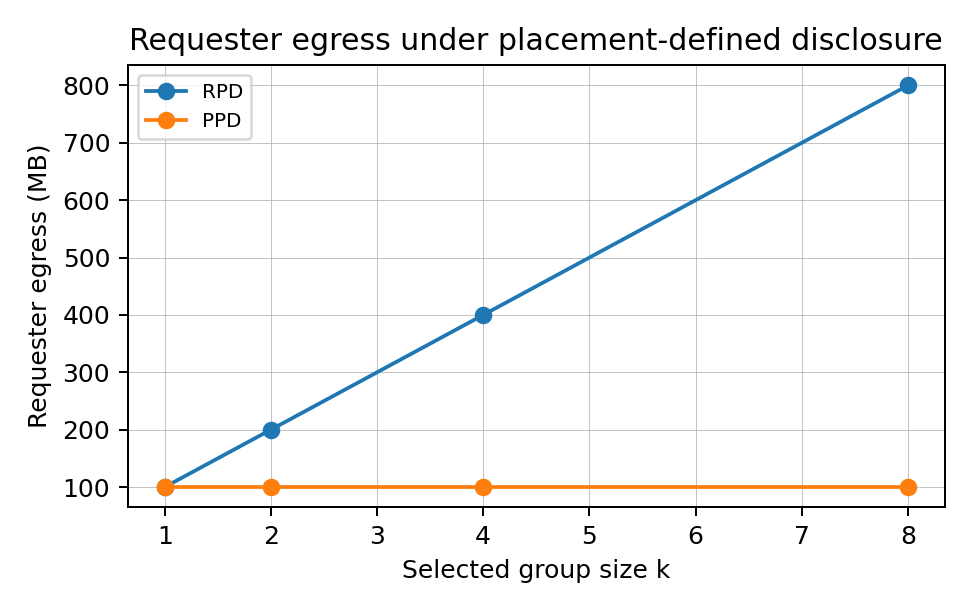

# Experiment B：Selective Delivery Group-Size Sweep 结果报告

## 1. 实验目标

本实验对应 `veriedge_revision_workbook.md` 的实验 B。目标是证明 placement 不只是选择执行节点，也定义 data boundary：只有 selected providers 收到可解密 task-access material。当 selected group size 增大时，RPD 需要从 requester 发送 `k` 份 encrypted payload，而 PPD 只需要 requester 发布 1 份 ciphertext，并向 selected providers 发送很小的 locator/key access packages。

## 2. 实验口径

本实验是 calibrated delivery-path replay/microbenchmark，不是 live multi-provider deployment。这样做的原因是当前仓库没有完整的一键多机 delivery sweep runner。为了避免伪装成真实部署，本实验明确区分三类数据：

- 真实测量：AES-GCM 加密吞吐、RSA-OAEP access package 大小。
- 模型输入：LAN/WAN bandwidth、RTT、loss/jitter，记录在 `metadata/network_config.md`。
- 推导指标：all-providers-ready latency、requester egress、store egress。

公平性定义：

- RPD 和 PPD 都使用 encrypted payload，不使用 plaintext。
- RPD 允许并行发送，但 requester uplink 是共享瓶颈，因此 requester egress 是 `kS`。
- PPD 中 requester 发布一次 ciphertext，发送 `k` 个 access packages；provider fetch latency 计入 `t5_all_ready_ms`。
- 每次 run 都生成 fresh task id / CID / task key，避免缓存假设。

## 3. 全量矩阵

| Dimension | Values |
|---|---|
| Payload size | 100MB |
| Group size | 1, 2, 4, 8 |
| Network | LAN, WAN |
| Mode | RPD, PPD |
| Runs per cell | 30 |
| Total runs | 480 |

## 4. 主结果

| Network | k | RPD median ms | PPD median ms | Median reduction | RPD requester MB | PPD requester MB | PPD store MB | Requester egress reduction |
|---|---:|---:|---:|---:|---:|---:|---:|---:|
| LAN | 1 | 863.6 | 1719.3 | -99.1% | 100.0 | 100.001 | 100.0 | -0.0% |
| LAN | 2 | 1714.8 | 1719.9 | -0.3% | 200.0 | 100.001 | 200.0 | 50.0% |
| LAN | 4 | 3416.6 | 1719.4 | 49.7% | 400.0 | 100.002 | 400.0 | 75.0% |
| LAN | 8 | 6820.5 | 1719.2 | 74.8% | 800.0 | 100.005 | 800.0 | 87.5% |
| WAN | 1 | 20087.6 | 30258.6 | -50.6% | 100.0 | 100.001 | 100.0 | -0.0% |
| WAN | 2 | 40099.2 | 30271.8 | 24.5% | 200.0 | 100.001 | 200.0 | 50.0% |
| WAN | 4 | 80088.4 | 30266.8 | 62.2% | 400.0 | 100.002 | 400.0 | 75.0% |
| WAN | 8 | 160099.6 | 30266.9 | 81.1% | 800.0 | 100.005 | 800.0 | 87.5% |

## 5. 结果解读

Requester egress 呈现手册预期的复杂度差异。RPD 在 LAN 下从 k=1 的 100.0MB 增长到 k=8 的 800.0MB，近似 `O(kS)`。PPD 从 k=1 的 100.0MB 增长到 k=8 的 100.0MB，近似 `O(S + k epsilon)`，因为每个 provider 只额外收到一个小 access package。

Latency 的趋势也符合 selective delivery 的直觉。k 较小时，PPD 需要先 publish 再 provider fetch，可能不一定优于 RPD；但随着 k 增大，RPD 的 requester uplink 要承载多份 full payload，而 PPD 的 requester critical path 接近一次 payload publication 加小包分发。到 k=8，LAN 下 PPD median latency 相对 RPD 下降 74.8%，WAN 下下降 81.1%。

这个结果支撑 data-boundary claim：placement commitment 后，VeriEdge 不需要把 full encrypted payload 复制给所有候选节点，而是只向 selected providers 释放 decryptable task access。PPD 的收益不是“避免加密”，因为 RPD/PPD 都使用 encrypted payload；收益来自 post-placement targeted access release。

## 6. 图表

- `figures/fig_delivery_latency_lan.pdf`：LAN 下 group size 对 median/p95 all-providers-ready latency 的影响。
- `figures/fig_delivery_latency_wan.pdf`：WAN 下 group size 对 median/p95 all-providers-ready latency 的影响。
- `figures/fig_delivery_egress_group_size.pdf`：requester egress 随 group size 增长的趋势，展示 `kS` vs `S+k epsilon`。

## 7. 自审结果

Audit status: **PASS**

- RPD/PPD 使用相同 payload size、network condition、provider count。
- 每次 run 生成 fresh CID/task key。
- WAN/LAN 参数已写入 metadata。
- RPD baseline 明确为并行发送、共享 requester uplink。
- Summary 报告 median、p95、mean。
- requester egress 和 store egress 分开记录。
- 图表由同一份 delivery_summary.csv 生成。

## 8. 论文引用建议

建议把该实验写成 selective delivery microbenchmark，而不是端到端 inference deployment。可以安全引用：

> For a 100MB encrypted payload and k=8 selected providers, PPD reduces requester egress by 87.5% and median all-providers-ready latency by 74.8% on the LAN profile, and by 87.5% / 81.1% on the WAN profile, under the calibrated delivery model.
