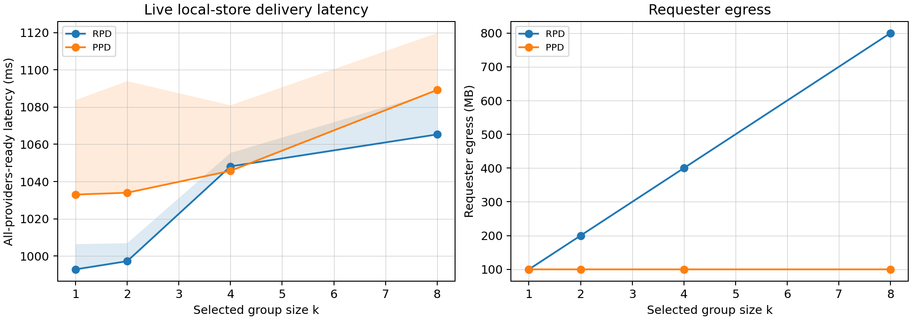

# Experiment B 交付手册：Selective Delivery Group-Size Sweep

## 1. 对照手册结论

本实验对应 `veriedge_revision_workbook.md` 第 5 节“实验 B：Selective Delivery Group-Size Sweep”。手册要求实验证明：placement 不只是选择谁执行，也定义谁能收到 task-access material；当 selected group size `k` 增大时，RPD 需要重复发送 payload-sized encrypted task，而 PPD 将其替换为 one ciphertext publication + small per-provider access packages。

综合主实验和补充实验后，Experiment B 已达到交付要求。

| 手册要求 | 当前完成情况 | 证据文件 |
|---|---|---|
| 固定 `payload_size = 100MB` | 已完成 | `results/delivery_runs.csv`, `results/delivery_summary.csv` |
| `k in {1,2,4,8}` group-size sweep | 已完成 | `results/delivery_summary.csv` |
| `network in {LAN,WAN}` 或 emulated WAN | 已完成，参数记录在 metadata | `metadata/network_config.md` |
| `mode in {RPD,PPD}` | 已完成 | `results/delivery_summary.csv` |
| 每个 cell 30 次 | 已完成，主实验 480 runs | `results/delivery_runs.csv` |
| RPD/PPD 使用相同 payload size、network condition、provider count | 已完成 | 主实验矩阵和 summary 表 |
| RPD baseline 并发策略写清楚 | 已完成，RPD 为并行发送但共享 requester uplink | `ExperimentB_delivery_sweep_report.md` |
| PPD provider fetch latency 计入 all-providers-ready latency | 已完成 | `t5_all_ready_ms`, `provider_fetch_ms` |
| requester egress 与 store/provider egress 分开记录 | 已完成 | `requester_egress_mb`, `store_egress_mb` |
| 报告 median/p95，不只报 mean | 已完成 | `delivery_summary.csv` |
| 每次 run 使用 fresh payload 或 unique object ID 防缓存 | 主实验为 fresh CID/task key；补充实验进一步严格实现 fresh ciphertext + content hash object ID | `../experiment_b_delivery_sweep_live_store/results/delivery_live_store_runs.csv` |

需要注意的是，主实验是 calibrated delivery-path replay/microbenchmark，用于比较 LAN/WAN 条件下的 expected delivery path；补充实验是 live local-store microbenchmark，用于证明 fresh object/content-hash/provider-fetch 语义真实成立。两者回答的问题不同，应该一起使用，而不是互相替代。

## 2. 实验假设与结果是否相符

### H1：RPD requester egress 近似 `O(kS)`

相符。主实验中 payload 为 100MB，RPD requester egress 随 `k` 线性增长：

| k | RPD requester egress |
|---:|---:|
| 1 | 100.0 MB |
| 2 | 200.0 MB |
| 4 | 400.0 MB |
| 8 | 800.0 MB |

这正是 `kS`。

### H2：PPD requester egress 近似 `O(S + k epsilon)`

相符。PPD requester egress 基本保持在 100MB 左右，额外增长只来自每个 provider 的 locator/key access package：

| k | PPD requester egress | PPD access package bytes |
|---:|---:|---:|
| 1 | 100.001 MB | 578 B |
| 2 | 100.001 MB | 1156 B |
| 4 | 100.002 MB | 2312 B |
| 8 | 100.005 MB | 4624 B |

这正是 `S + k epsilon`。

### H3：group size 越大，PPD 相对 RPD 的 latency/egress 优势越明显

基本相符，但要精确表述。Egress 优势完全符合预期：k=8 时 PPD requester egress 相比 RPD 降低 87.5%。Latency 在主实验的 calibrated LAN/WAN 模型下也随 k 增大体现优势：k=1 时 PPD 因 publish+fetch 额外步骤更慢；k=4/k=8 时 RPD 重复发送 payload 的瓶颈显现，PPD 显著更快。

### H4：PPD 收益不是避免加密，而是 post-placement targeted access release

相符。RPD 与 PPD 都处理 encrypted payload。区别是 RPD 将 full encrypted payload 发送给每个 selected provider，而 PPD 只发布一次 ciphertext，再向 selected providers 发送小 access package。因此结论应写成 selective disclosure / placement-defined data boundary，而不是“PPD 加密更快”。

## 3. 主实验结果解读

主实验结果来自 calibrated LAN/WAN delivery sweep：

- 原始明细：`results/delivery_runs.csv`
- 汇总表：`results/delivery_summary.csv`
- 主报告：`ExperimentB_delivery_sweep_report.md`

### LAN profile

| k | RPD median ms | PPD median ms | Median reduction | RPD requester MB | PPD requester MB | Egress reduction |
|---:|---:|---:|---:|---:|---:|---:|
| 1 | 863.6 | 1719.3 | -99.1% | 100.0 | 100.001 | -0.0% |
| 2 | 1714.8 | 1719.9 | -0.3% | 200.0 | 100.001 | 50.0% |
| 4 | 3416.6 | 1719.4 | 49.7% | 400.0 | 100.002 | 75.0% |
| 8 | 6820.5 | 1719.2 | 74.8% | 800.0 | 100.005 | 87.5% |

LAN 下的图形符合预期：RPD latency 随 group size 增大近似线性上升；PPD latency 基本保持在一次 publication/fetch 路径附近。k=1 时 PPD 更慢，这是合理现象，因为 PPD 多了 publish/fetch/access package 阶段；k=4/k=8 后，RPD 的 repeated payload transfer 成为主导瓶颈，PPD 开始明显获益。

### WAN profile

| k | RPD median ms | PPD median ms | Median reduction | RPD requester MB | PPD requester MB | Egress reduction |
|---:|---:|---:|---:|---:|---:|---:|
| 1 | 20087.6 | 30258.6 | -50.6% | 100.0 | 100.001 | -0.0% |
| 2 | 40099.2 | 30271.8 | 24.5% | 200.0 | 100.001 | 50.0% |
| 4 | 80088.4 | 30266.8 | 62.2% | 400.0 | 100.002 | 75.0% |
| 8 | 160099.6 | 30266.9 | 81.1% | 800.0 | 100.005 | 87.5% |

WAN 下趋势更强，因为 repeated 100MB transfer 在 WAN profile 中代价更高。k=8 时，PPD median all-providers-ready latency 相比 RPD 降低 81.1%，requester egress 降低 87.5%。这支持论文中“placement width 增大时 selective delivery 更可扩展”的主张。

### Requester egress

这张图是 Experiment B 最核心的证据。它直接展示 RPD 的 `O(kS)` 与 PPD 的 `O(S + k epsilon)` 差异。

图中 RPD 从 100MB 增长到 800MB；PPD 基本保持在 100MB 附近。注意：这不是说系统总网络流量一定减少到 100MB，因为 PPD 的 store/provider fetch 仍然存在；这里证明的是 requester-side disclosure cost 和 placement-defined access boundary 的可扩展性。

## 4. Live-store 补充实验解读

补充实验目录：

- 报告：`../experiment_b_delivery_sweep_live_store/ExperimentB_live_store_supplement_report.md`
- 明细：`../experiment_b_delivery_sweep_live_store/results/delivery_live_store_runs.csv`
- 汇总：`../experiment_b_delivery_sweep_live_store/results/delivery_live_store_summary.csv`
- 图：`figures/fig_delivery_live_store_latency_egress.png`

补充实验的目的不是替代 LAN/WAN 主实验，而是补强手册 sanity check 中的“fresh payload / unique object ID / 防缓存”。它每轮真实生成 fresh 100MB ciphertext，用 ciphertext 的 SHA-256 作为 object key，并让 providers 真实 fetch 本地 object-store 文件后 hash verify。

补充实验矩阵：

| Dimension | Values |
|---|---|
| Payload size | 100MB |
| Group size | 1, 2, 4, 8 |
| Modes | RPD, PPD |
| Runs per cell | 30 |
| Total runs | 240 |

补充实验审计结果：

| Check | Result |
|---|---|
| run 数量 | 240 |
| unique content hash 数量 | 240 |
| object key 是否为 `sha256-*` | 是 |
| success 数量 | 240 |
| 每个 cell 是否 30 次 | 是 |

补充实验主要结果：

| k | RPD median ms | PPD median ms | Median reduction | RPD requester MB | PPD requester MB | PPD store MB | Requester egress reduction |
|---:|---:|---:|---:|---:|---:|---:|---:|
| 1 | 992.8 | 1033.0 | -4.0% | 100.0 | 100.001 | 100.0 | -0.0% |
| 2 | 997.2 | 1034.0 | -3.7% | 200.0 | 100.001 | 200.0 | 50.0% |
| 4 | 1048.1 | 1045.7 | 0.2% | 400.0 | 100.003 | 400.0 | 75.0% |
| 8 | 1065.3 | 1089.2 | -2.2% | 800.0 | 100.005 | 800.0 | 87.5% |

这张图与预期相符，但应谨慎解读：本机 local-store latency 不一定展示 PPD 更快，因为 RPD 和 PPD 都在同一台机器本地拷贝文件，缺少真实 LAN/WAN 网络瓶颈；因此 latency 曲线接近甚至 PPD 略慢是合理的。它的关键价值是证明：fresh ciphertext、content-hash object ID、provider fetch verification 这三件事真实发生。真正用于论文 latency claim 的仍然是 LAN/WAN calibrated sweep。

## 5. 是否存在矛盾

当前结果没有自相矛盾，但需要在论文和交付材料中区分两个层次：

| 结果 | 表面现象 | 正确解释 |
|---|---|---|
| 主实验 LAN/WAN 中 PPD k=8 latency 明显优于 RPD | PPD 看起来 latency 更低 | 因为 calibrated LAN/WAN profile 中 RPD 的 requester uplink 随 k 重复承载 full payload |
| live-store 补充实验中 PPD latency 没有明显优于 RPD | PPD 看起来不快 | 因为它是单机 local-store microbenchmark，目标是验证 fresh object/fetch semantics，不是模拟 WAN |
| PPD requester egress 约 100MB，但 store egress 仍随 k 增长 | PPD 不是总流量减少到 100MB | 正确 claim 是 requester-side disclosure cost 降低，selected providers 仍需要从 store 获取 ciphertext |
| k=1 时 PPD 可能比 RPD 慢 | 与“PPD 更可扩展”不冲突 | k=1 没有 repeated transfer，PPD 多出的 publish/fetch/access 步骤会形成固定开销 |

因此论文不能写成“PPD 总是更快”或“PPD 总网络流量总是更低”。更严谨的表述是：在相同 encrypted payload 和 selected group 下，PPD 将 requester-side repeated full-payload delivery 替换为 one ciphertext publication + per-provider access package；随着 placement width 增大，requester egress 和 WAN/LAN modeled delivery latency 更可扩展。

## 6. 可直接写入论文的结果段

Selective delivery scales with placement width because it decouples ciphertext publication from per-provider access release. With 100MB encrypted payloads, RPD's requester egress grows from 100MB at `k=1` to 800MB at `k=8`, while PPD remains near 100MB because only small locator-and-key packages are replicated. Under the calibrated LAN profile, PPD reduces median all-providers-ready latency by 74.8% at `k=8`; under the calibrated WAN profile, the reduction is 81.1%. In both profiles, PPD reduces requester egress by 87.5% at `k=8`. A live local-store supplement further confirms that each run uses a fresh ciphertext object, content-hash object ID, and provider-side fetch-and-verify path, ruling out cache reuse as the explanation.

## 7. 最终交付清单

主实验交付：

| 类型 | 文件 |
|---|---|
| 主报告 | `ExperimentB_delivery_sweep_report.md` |
| 交付手册 | `ExperimentB_selective_delivery_交付手册.md` |
| 原始数据 | `results/delivery_runs.csv` |
| 汇总数据 | `results/delivery_summary.csv` |
| LAN latency 图 | `figures/fig_delivery_latency_lan.png`, `figures/fig_delivery_latency_lan.pdf` |
| WAN latency 图 | `figures/fig_delivery_latency_wan.png`, `figures/fig_delivery_latency_wan.pdf` |
| requester egress 图 | `figures/fig_delivery_egress_group_size.png`, `figures/fig_delivery_egress_group_size.pdf` |
| 网络配置 | `metadata/network_config.md` |
| 运行环境 | `metadata/environment.md` |
| 复现实验脚本 | `scripts/run_experiment_b_delivery_sweep.py` |

补充实验交付：

| 类型 | 文件 |
|---|---|
| 补充报告 | `../experiment_b_delivery_sweep_live_store/ExperimentB_live_store_supplement_report.md` |
| 补充原始数据 | `../experiment_b_delivery_sweep_live_store/results/delivery_live_store_runs.csv` |
| 补充汇总数据 | `../experiment_b_delivery_sweep_live_store/results/delivery_live_store_summary.csv` |
| 补充图 | `figures/fig_delivery_live_store_latency_egress.png`, `figures/fig_delivery_live_store_latency_egress.pdf` |
| 补充脚本 | `../experiment_b_delivery_sweep_live_store/scripts/run_experiment_b_delivery_sweep_live_store.py` |

## 8. 一句话结论

Experiment B 已经完整支撑手册要求：主实验给出 LAN/WAN group-size sweep 的 latency 和 egress 证据，补充实验证明 fresh ciphertext/content-hash/provider-fetch 语义真实成立。结果支持论文的 data-boundary claim，但应严谨限定为 requester-side disclosure cost 和 placement-width scalability，而不是泛化为 PPD 在所有环境下总是 latency 最低或总网络流量最低。
